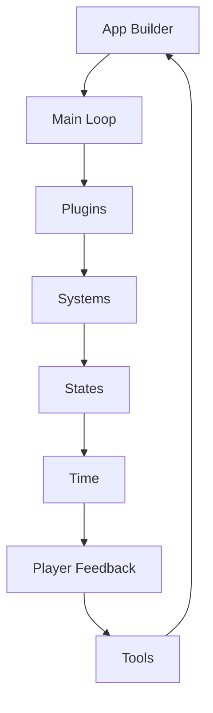
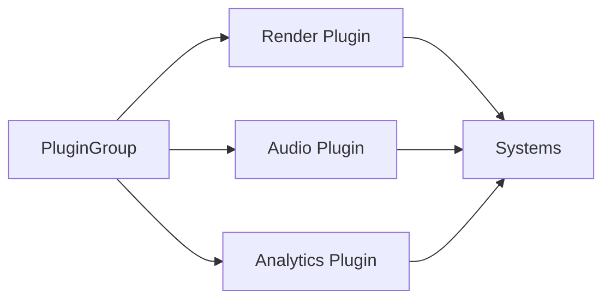
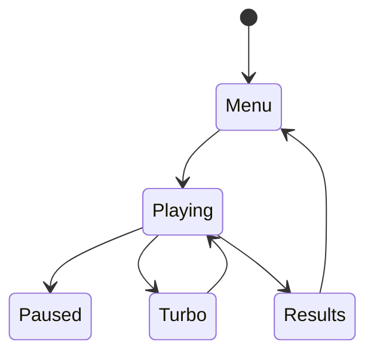

# Chapter 1 — Bootstrapping the Engine

Part 1 opens with the practical steps every Bevy project takes: creating an `App`, layering plugins, and shaping the main loop. This chapter introduces the core systems through the lens of building a cohesive machine: we start with a spark of execution, wire subsystems together, and end with a rhythm that players and designers can trust. Every stop references concrete examples so you can inspect the source while the narrative explains how the pieces cooperate.



## The First Spark: Bringing the App to Life

The journey starts with the barest heartbeat. The skeleton from `examples/hello_world.rs` proves that an `App::new().add_systems` pipeline can stand on its own—perfect for build smoke tests. When you need a silent sandbox, `examples/app/empty.rs` removes even the default plugins, leaving pure ECS so experimental systems can be composed without windowing or input noise.

Most teams keep a canonical reference of what *should* load at boot. `examples/app/empty_defaults.rs` documents the `DefaultPlugins` stack; whenever an upgrade goes sideways, you can diff that example against your project to spot missing modules. Sometimes you want the window but not the rendering: `examples/app/no_renderer.rs` keeps the platform surface alive while skipping GPU work. That combination is invaluable for automated compliance tests where focus events and accessibility matter more than pixels.

## Tuning the Heartbeat: Runners and Execution Profiles

Once the app stands, you decide how it should pulse. `examples/app/headless.rs` swaps the default runner for `ScheduleRunnerPlugin`, giving you a deterministic loop for server simulations. When rendering still matters but windows do not, `examples/app/headless_renderer.rs` pipes wgpu output to textures—ideal for screenshot automation or regression captures.

Control sometimes needs to be manual. The pattern from `examples/app/custom_loop.rs` lets designers tick the world one input at a time, great for debugging turn-based encounters. For batch workflows that should run once and exit, `examples/app/without_winit.rs` executes a single tick without ever creating a window. Tool authors who embed Bevy into larger applications adopt `examples/app/return_after_run.rs` to regain control after the main window closes.

```rust
fn bootstrap_manual_runner() {
    let mut app = App::new();
    app.add_plugins(MinimalPlugins);
    app.set_runner(|mut app| {
        for line in std::io::stdin().flatten() {
            if line.trim() == "quit" {
                break;
            }
            app.update();
        }
    });
    app.run();
}
```

This skeleton, adapted from `examples/app/custom_loop.rs` and `examples/app/without_winit.rs`, keeps the world deterministic and exit-friendly while you wire bespoke debugging commands.


Performance engineers finish the tuning by shaping the worker pool. `examples/app/thread_pool_resources.rs` exposes how to pin thread counts or priority, keeping console builds and dedicated servers in sync.

### Game Context: Orbit Foundry Build Farm
In the live-ops build farm for **Orbit Foundry**, engineers run nightly smoke tests with `examples/app/headless.rs` so server logic advances without graphics, capture regression footage through `examples/app/headless_renderer.rs`, and mirror console thread budgets by applying the patterns from `examples/app/thread_pool_resources.rs`. The trio keeps automated review suites faithful to shipping builds while staying cheap to operate.


## Assembling Systems: Plugins as Crew

With the heartbeat steady, the ship needs specialists. `examples/app/plugin.rs` demonstrates how to package setup systems and resources into a reusable plugin so features remain modular. When several plugins always travel together—rendering stacks, monetisation hooks, platform APIs—`examples/app/plugin_group.rs` bundles them into a single registration line, preventing drift between binaries.



## Listening to the Engine: Observability

No machine thrives without telemetry. `examples/app/logs.rs` is the quickest route to structured tracing; it shows how to enable logging from day one so designers can toggle verbosity without recompiling. Different crews need different dashboards, so infrastructure engineers lean on `examples/app/log_layers.rs` to stack custom tracing layers and route messages to the right sink. When those logs should surface inside the game itself, `examples/app/log_layers_ecs.rs` channels them into ECS resources, letting HUDs and debug overlays glow when critical events fire.

## Welcoming Human Hands: Tooling Touchpoints

A responsive toolchain keeps iteration joyful. The drag-and-drop integration from `examples/app/drag_and_drop.rs` lets artists toss textures or scenes into a running build; systems react immediately, turning the engine into a live playground. Designers grow powerful context menus by riffing on `examples/usage/context_menu.rs`, toggling cheats, presets, or debugging overlays without leaving full-screen. Meanwhile, competitive games rely on transparent cooldowns—`examples/usage/cooldown.rs` ties timers to UI so players trust ability recovery even when frame pacing shifts.

## Orchestrating Flow: States and Time Working Together

As features accumulate, flow control keeps chaos in check. `examples/state/states.rs` maps high-level phases—menus, gameplay, results—into explicit `States` with `OnEnter` and `OnExit` hooks. When the same state should trigger special behaviour on re-entry, `examples/state/custom_transitions.rs` illustrates how to implement `OnReenter` and `OnReexit` callbacks. Designers who ship mutators or difficulty modifiers adopt `examples/state/computed_states.rs`, letting derived states such as "Turbo Mode" automatically adjust active systems. Nested experiences like pause overlays or in-game photo modes lean on `examples/state/sub_states.rs`, keeping auxiliary logic scoped under the parent state.

Time resources complement state machines. New hires study `examples/time/time.rs` to understand how delta time drives systems. Gameplay loops that juggle spawn schedules or ability recovery share the component-and-resource pattern from `examples/time/timers.rs`. Finally, broadcasters and replay tools rely on `examples/time/virtual_time.rs` to decouple simulation time from real time so they can pause, fast-forward, or slow-mo without desynchronising the world.

### Game Context: Dynamo Dungeon Control Loop
Production on the tactical RPG **Dynamo Dungeon** leans on `examples/state/computed_states.rs` to toggle combat modifiers, folds pause menus in via `examples/state/sub_states.rs`, and keeps ability cooldown widgets honest by pairing `examples/time/timers.rs` with the UI pattern from `examples/usage/cooldown.rs`. When QA captures replays, they flip into virtual time using `examples/time/virtual_time.rs` so the same cutscene can be scrubbed frame by frame without disrupting network clients.

```rust
fn register_states(app: &mut App) {
    app.add_state::<GameState>()
        .add_systems(OnEnter(GameState::Battle), setup_battle)
        .add_systems(Update, (tick_cooldowns, update_mutators).run_if(in_state(GameState::Battle)))
        .insert_resource(VirtualTime::default());
}

fn tick_cooldowns(time: Res<Time>, mut cooldowns: Query<&mut CooldownTimer>) {
    for mut timer in &mut cooldowns {
        timer.0.tick(time.delta());
    }
}
```

The skeleton stitches together the approaches from `examples/state/states.rs`, `examples/state/computed_states.rs`, and `examples/time/timers.rs`: states gate which systems run, while cooldown timers stay in sync with both real and virtual time.




## Practice Prompts
- Build a launcher that exposes multiple execution profiles: headless (`examples/app/headless.rs`), off-screen rendering (`examples/app/headless_renderer.rs`), and manual stepping (`examples/app/custom_loop.rs`).
- Extend the analytics overlay by combining `examples/app/log_layers_ecs.rs` with the state machine from `examples/state/computed_states.rs`, surfacing mutator status directly in the HUD.
- Fuse virtual time control (`examples/time/virtual_time.rs`) with the cooldown HUD (`examples/usage/cooldown.rs`) so pausing gameplay freezes ability recovery visualisations.

## Runbook
To explore the chapter hands-on, start with the commands below, then branch into the other scenarios described above as your project demands.

```
cargo run --example hello_world
cargo run --example headless
cargo run --example custom_loop
cargo run --example plugin_group
cargo run --example log_layers_ecs
cargo run --example computed_states
```
