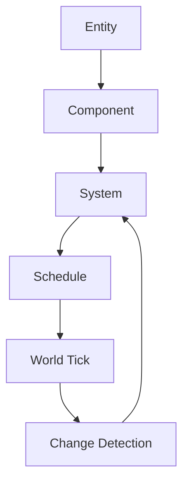
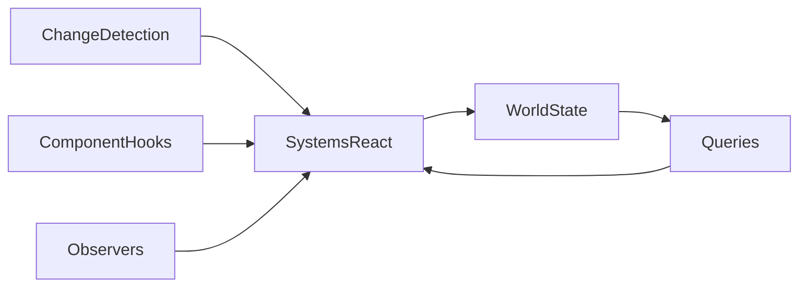
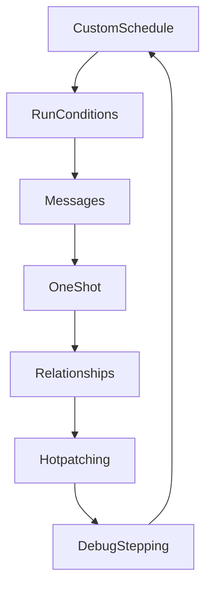

# Chapter 2 — Thinking in ECS

Bevy’s power lies in how entities, components, and systems braid together. Rather than paging through APIs, this chapter tells the story of how data, behaviour, and scheduling collaborate to keep a world alive. Every scene below points to a concrete example so you can jump from narrative to source in a single heartbeat.



## Components, Bundles, and System Queries

The conversation starts with the guided overview in `examples/ecs/ecs_guide.rs`, which lays out how entities hold components and systems act upon their data. From there, builders reach for `examples/ecs/dynamic.rs` when components must be created at runtime; the pattern lets toolchains spawn arbitrary data without recompiling. Once the world is populated, hierarchy becomes essential—`examples/ecs/hierarchy.rs` shows how parent and child transforms propagate, letting multi-part machines pivot as one.

Reactive behaviour keeps scenes honest. `examples/ecs/change_detection.rs` teaches systems to wake only when data truly shifts, while `examples/ecs/removal_detection.rs` closes the loop by signalling when components vanish. When data is scoped to particular game phases, `examples/ecs/state_scoped.rs` automatically despawns state-specific entities so menus, levels, and overlays clean up after themselves.

Lifecycle hooks help data police itself. `examples/ecs/component_hooks.rs` demonstrates how components can validate or initialise values the moment they attach to entities, and `examples/ecs/immutable_components.rs` records the cases where immutable data still participates in updates. Observability extends beyond hooks: `examples/ecs/observers.rs` wires custom observers that listen to component changes, while `examples/ecs/observer_propagation.rs` cascades those events across hierarchies.

Expressive queries glue the data graph together. The struct-based approach from `examples/ecs/custom_query_param.rs` replaces tuple juggling with named fields so complex systems remain legible. When behaviour should adapt to type parameters, `examples/ecs/generic_system.rs` shows how generics keep logic DRY across multiple components. Heavy worlds stay responsive thanks to the iterators in `examples/ecs/parallel_query.rs`, which fan queries across threads, and the pairwise scans in `examples/ecs/iter_combinations.rs`, which power proximity checks without extra bookkeeping.

### Deep Dive: Observer Cascades
The `examples/ecs/observers.rs` sample shows that observers are just systems waiting for targeted stimuli. You register them with `App::add_observer` or `Commands::observe`, then hand them `On<T>` parameters so they wake only when the right component lifecycle or event fires.

```rust
fn plugin(app: &mut App) {
    app.add_observer(|alert: On<CompanionAlert>, units: Query<&UnitState>, mut commands: Commands| {
        if let Ok(state) = units.get(alert.entity) {
            if state.is_compromised() {
                commands.trigger(DispatchSupport { target: alert.entity });
            }
        }
    });
}

fn register_unit(mut commands: Commands, entity: Entity) {
    commands.entity(entity).observe(track_assignments);
}
```

The first observer listens for a custom event and conditionally triggers follow-up work, mirroring the minefield cascade in `examples/ecs/observers.rs`. The second line mirrors `observe(explode_mine)`, wiring an entity-scoped observer so each unit can react when its own assignments change. Together they keep orchestration responsive without forcing wide queries every frame.




### Game Context: Starfall Tactics Systems
In **Starfall Tactics**, a squad-based tactics title, ships spawn with bespoke loadouts using the patterns from `examples/ecs/custom_query_param.rs`. A setup system injects faction-specific bundles, and a follow-up maintenance system relies on change detection (`examples/ecs/change_detection.rs`) to recalculate power distribution only when components actually mutate. Commands drive entity creation in orchestrated phases so that the UI can hook into observers without double-counting spawns.

```rust
fn spawn_frigates(mut commands: Commands, roster: Res<Roster>) {
    for ship in roster.frigates() {
        commands.spawn((ship.transform(), ship.loadout(), ShipTag));
    }
}

fn refresh_power(mut query: Query<&mut PowerGrid, Changed<Modules>>) {
    for mut grid in &mut query {
        grid.rebalance();
    }
}
```

Without change detection, the refresh system would run every frame, consuming CPU even when modules remain untouched.

#### When to Avoid It
Deriving elaborate `QueryData` structs for one-off inspections can backfire. For small interactions—like checking a single component in a debug command—Starfall Tactics falls back to tuple queries to avoid maintaining separate structs that nobody reuses.

## Resources, Events, and Global Coordination

Sometimes the world needs a central voice. `examples/ecs/fallible_params.rs` illustrates how systems can politely decline to run when critical resources are missing, keeping error handling deliberate instead of panicked. When information should ripple outward, the propagation pipeline in `examples/ecs/observer_propagation.rs` forwards events through entity hierarchies so parent controllers and child widgets stay in sync.

### Deep Dive: Event Wiring
`examples/ecs/fallible_params.rs` demonstrates how Bevy refuses to run systems that require missing resources, avoiding panics and surfacing actionable logs instead. Pair that with `examples/ecs/observer_propagation.rs`, which listens for component add/remove events and forwards them through the hierarchy so UI widgets or audio cues stay synchronized.

```rust
#[derive(Event)]
struct CompanionAlert(Entity);

fn emit_alert(
    mut commands: Commands,
    mut events: EventWriter<CompanionAlert>,
    query: Query<(Entity, &UnitState), Added<UnitState>>
) {
    for (entity, state) in &query {
        if state.is_compromised() {
            events.send(CompanionAlert(entity));
        }
    }
    // Ensure we only run when UnitRegistry is present
    commands.run_if_resource_exists::<UnitRegistry>();
}
```

Observers keep the floodgates closed: only components that actually change wake the systems, and fallible parameters protect the code path when late-joining plugins forget to register resources.

```rust
fn register_alert_pipeline(app: &mut App) {
    app.add_systems(
        Update,
        (emit_alert, propagate_alerts)
            .run_if(resource_exists::<UnitRegistry>)
    );
}
```

This mirrors the guard pattern from `examples/ecs/fallible_params.rs`: the systems only join the schedule when the prerequisite resource exists, letting your event wiring stay intentional rather than panicking at runtime.

### Game Context: Mecha Relay Network
Multiplayer ops title **Mecha Relay** keeps its command net tidy by combining `examples/ecs/fallible_params.rs` with `examples/ecs/observer_propagation.rs`. Before broadcasting squad alerts, controllers call the fallible-parameter gate to ensure logistics resources are ready; once cleared, observers cascade state changes through cockpit UI widgets and AI support drones, guaranteeing everyone hears the order exactly once.

#### When to Avoid It
Reserve observers for meaningful state transitions. If designers toggle debug flags every frame, emitting events on each tick will drown the system and defeat the purpose of selective wake-ups—stick to direct queries in those high-frequency paths.


Those techniques pair naturally with the logging bridge from `examples/app/log_layers_ecs.rs` back in Chapter 1: together they let you surface authoritative alerts, buffer them in resources, and let observers broadcast updates to whichever systems care most. Bevy currently ships `fallible_params` and `observer_propagation` as the canonical resource/event showcases, so this section leans on them heavily while encouraging teams to layer bespoke streams on top.

## Advanced ECS Patterns

Once the core vocabulary is fluent, advanced phrasing opens up. Scheduling control begins with `examples/ecs/custom_schedule.rs`, which nests custom phases alongside Bevy’s built-in Update and Last stages. When entities need to disappear without being destroyed, `examples/ecs/entity_disabling.rs` keeps them dormant, ready to rejoin gameplay later.

Robust applications plan for mishaps. `examples/ecs/error_handling.rs` shows how fallible systems lean on Rust’s `Result` ergonomics, while `examples/ecs/fallible_params.rs` (seen above) prevents invalid access in the first place. Temporal precision arrives via `examples/ecs/fixed_timestep.rs`, ensuring physics or simulation beats remain consistent no matter the frame rate.

Runtime creativity follows. Hot-reload toolchains lean on `examples/ecs/hotpatching_systems.rs` to swap system logic without downtime, whereas messaging-heavy games start with `examples/ecs/message.rs` and graduate to `examples/ecs/send_and_receive_messages.rs` when a single system must both enqueue and consume messages in order. To keep those messages in the right order, `examples/ecs/run_conditions.rs` and `examples/ecs/nondeterministic_system_order.rs` spell out how to express dependencies so parallel execution never surprises you.

One-shot logic deserves its own spotlight: `examples/ecs/one_shot_systems.rs` demonstrates triggers that fire once and retire, perfect for cutscene cues. Entity relationships stretch beyond simple parent and child links—`examples/ecs/relationships.rs` maps richer graphs while staying query-friendly.

Starting and stopping cleanly rounds out the toolkit. `examples/ecs/startup_system.rs` captures work that should happen once at boot; `examples/ecs/system_closure.rs` proves closures can stand in as systems for rapid prototyping; `examples/ecs/system_param.rs` introduces custom `SystemParam` bundles so repetitive lookups collapse into one argument. When data needs to flow through multiple processing steps, `examples/ecs/system_piping.rs` chains functions into a single pipeline, and debugging sessions lean on `examples/ecs/system_stepping.rs` to walk systems in the order they execute.

### Game Context: Ironclad Skirmish Framework
Arena brawler **Ironclad Skirmish** schedules every match with `examples/ecs/custom_schedule.rs` so pre-round prep, mid-match logic, and sudden-death modifiers each live in distinct phases. Physics beats ride on `examples/ecs/fixed_timestep.rs`, while `examples/ecs/run_conditions.rs` guards optional systems—like hazard spawners—behind energy thresholds. Designers rehearse balance tweaks in real time by hot-swapping behaviours through `examples/ecs/hotpatching_systems.rs`, and QA uses `examples/ecs/system_stepping.rs` to replay troublesome frames.

```rust
fn build_match_schedule() -> Schedule {
    let mut schedule = Schedule::default();
    schedule.add_phase(PhaseLabel::PreRound);
    schedule.add_phase(PhaseLabel::Fight);
    schedule.add_systems(PhaseLabel::PreRound, prep_loadouts);
    schedule.add_systems(PhaseLabel::Fight, (
        apply_fixed_timestep.after(prep_loadouts),
        run_hazards.run_if(resource_exists::<HazardGrid>()),
    ));
    schedule.add_systems(PhaseLabel::Fight, resolve_combat.pipe(record_log));
    schedule
}
```

The skeleton mirrors `examples/ecs/custom_schedule.rs` and `examples/ecs/run_conditions.rs`: fixed-step bookkeeping keeps combat deterministic, run conditions stop dormant hazards from wasting cycles, and piping logs every outcome for post-match telemetry.

#### When to Avoid It
Reserve bespoke schedules for arenas that genuinely need separate rhythms. Lighter prototypes move faster by sticking with Bevy’s built-in Update stage and a handful of run criteria.

All of these ideas converge in relationships-first scheduling: messaging, run conditions, and fixed timesteps ensure the machine hums while hotpatching keeps it malleable enough to evolve mid-flight.



## Practice Prompts
- Combine the observer patterns from `examples/ecs/observers.rs` and the disable-and-resume workflow in `examples/ecs/entity_disabling.rs` to create stealth AI that sleeps until alerted.
- Prototype a modular combat system by chaining `examples/ecs/system_piping.rs` with the messaging loop from `examples/ecs/message.rs`, then hot swap behaviours using `examples/ecs/hotpatching_systems.rs`.
- Build a deterministic simulation by pairing `examples/ecs/fixed_timestep.rs` with the change detection in `examples/ecs/change_detection.rs`, ensuring only meaningful updates consume CPU.

## Runbook
Explore the narrative hands-on with a focused sampling, then branch into the remaining examples as questions arise:

```
cargo run --example ecs_guide
cargo run --example custom_query_param
cargo run --example observer_propagation
cargo run --example custom_schedule
cargo run --example run_conditions
cargo run --example system_stepping
```
