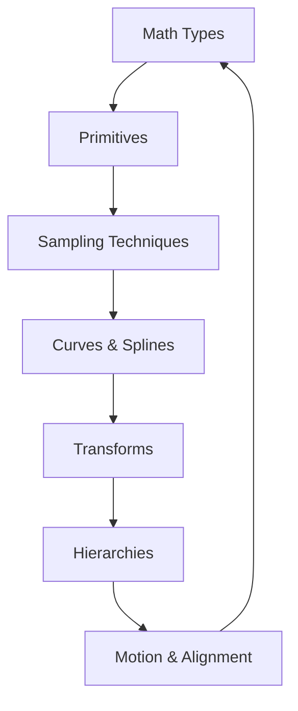
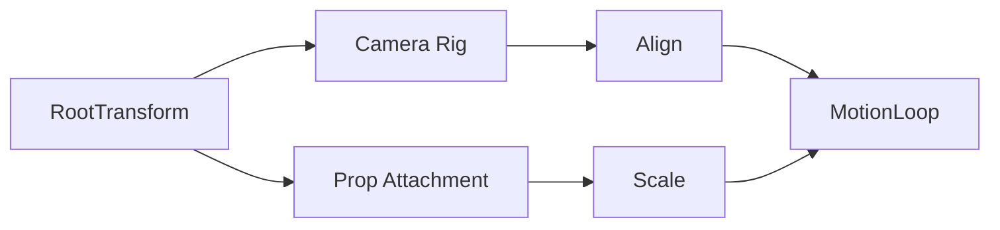

# Chapter 3 — Data and Space Fundamentals

From vector math to transform hierarchies, Bevy’s spatial toolkit keeps worlds consistent and expressive. This chapter stitches together the math utilities and transform tricks that let you choreograph motion, align props, and sample geometry without guesswork. Every scene below points to the specific examples backing the narrative so you can inspect the source while the story unfolds.



## Math Essentials for Game Worlds

The tour opens with Bevy’s own study guide. `examples/math/render_primitives.rs` renders the catalogue of shapes so you can see at a glance how spheres, capsules, and cuboids manifest both in meshes and gizmos. When collision checks matter more than screenshots, `examples/math/bounding_2d.rs` computes intersections across bounding boxes—perfect for lightweight hit tests in UI or 2D encounters.

Sampling keeps procedural content lively. `examples/math/random_sampling.rs` and its sibling `examples/math/sampling_primitives.rs` walk through picking random points from primitive shapes. Designers sprinkle these helpers into loot placement and creature spawning, knowing the distributions stay even without manual math.

Custom geometry builds on that foundation. `examples/math/custom_primitives.rs` proves you can extend Bevy’s primitive repertoire: implement the highlighted traits and your bespoke volumes plug into rendering, collision, and sampling straight away. Motion rarely wants straight lines, so `examples/math/cubic_splines.rs` introduces Bezier splines—favourites for camera moves, racing tracks, or any path that needs smooth arrival and departure.

Keeping all these techniques in mind, you can sketch a rough layout in minutes, test spacing with samples, then upgrade the pathing with splines once the gameplay gels.


### Game Context: Aurora Kart Track Tools
In the internal editor for **Aurora Kart**, level designers sketch grand prix circuits by chaining cubic splines from `examples/math/cubic_splines.rs`. They sample guardrail anchors using the random sampling patterns from `examples/math/random_sampling.rs`, then validate that karts stay inside safety bounds with `examples/math/bounding_2d.rs`. The same workflow renders quick previews via `examples/math/render_primitives.rs`, so designers can iterate before exporting to the main game.

```rust
fn spawn_guardrails(
    mut commands: Commands,
    mut meshes: ResMut<Assets<Mesh>>,
    mut materials: ResMut<Assets<ColorMaterial>>,
) {
    let segment = mesh::shape::Quad::new(Vec2::new(0.4, 2.0));
    for i in 0..72 {
        let angle = i as f32 / 72.0 * std::f32::consts::TAU;
        let pos = Vec3::new(angle.cos() * 18.0, angle.sin() * 18.0, 0.0);
        commands.spawn(MaterialMesh2dBundle {
            mesh: meshes.add(Mesh::from(segment.clone())).into(),
            material: materials.add(Color::srgba(0.2, 0.4, 0.8, 1.0)),
            transform: Transform::from_translation(pos)
                .with_rotation(Quat::from_rotation_z(angle)),
            ..default()
        });
    }
}
```

#### When to Avoid It
This pipeline excels for coarse track shaping, but live races rely on physics updates rather than recomputing splines every frame. Aurora Kart bakes splines into path data at build time; only the editor performs heavy sampling to keep the shipping build smooth.

## Transform Hierarchies and Spatial Tricks

Data alone doesn’t animate worlds; transforms translate it into motion. The all-in-one reference lives in `examples/transforms/transform.rs`, showcasing translation, rotation, and scale in one scaffold. When you need to stage movement along a specific axis, `examples/transforms/translation.rs` isolates positional control, while `examples/transforms/3d_rotation.rs` demonstrates orbiting props and cameras around chosen pivots.

Scaling joins the conversation through `examples/transforms/scale.rs`, capturing both uniform and non-uniform adjustments—handy when props need to stretch or squash mid-animation. Orientation alignment becomes effortless with `examples/transforms/align.rs`, which lets you point objects toward targets while locking another axis, a staple for turrets, characters, and UI billboards.



These transform techniques shine brightest inside hierarchies. Parent entities drive children automatically, so once you orbit a root rig, attached cameras and props follow suit. Combine axis-specific translation with rotational pivots and you get complex animation arcs without juggling matrices by hand.


### Game Context: SkyStage Cinematics
The cutscene team on **SkyStage Chronicles** attaches spotlight rigs and floating props to characters using the parenting patterns from `examples/transforms/transform.rs` and `examples/transforms/align.rs`. Cameras orbit the action with `examples/transforms/3d_rotation.rs`, while animated billboards stretch using `examples/transforms/scale.rs`.

```rust
fn retarget_spotlight(
    mut lights: Query<&mut Transform, With<CinematicSpotlight>>,
    hero: Query<&GlobalTransform, With<HeroActor>>
) {
    let hero_transform = hero.single();
    for mut transform in &mut lights {
        transform.translation = hero_transform.translation() + Vec3::new(0.0, 4.0, -2.0);
        transform.look_at(hero_transform.translation(), Vec3::Y);
    }
}
```

The snippet echoes `examples/transforms/align.rs`: parenting keeps lights glued to the rig, while the per-frame look-at call mirrors the axis-aware alignment pattern so spotlights never drift off target.


```rust
fn attach_orbiting_camera(mut commands: Commands) {
    commands
        .spawn((SpatialBundle::default(), CinematicRig))
        .with_children(|parent| {
            parent.spawn(Camera3dBundle {
                transform: Transform::from_xyz(6.0, 3.0, 0.0)
                    .looking_at(Vec3::ZERO, Vec3::Y),
                ..default()
            });
        });
}
```

#### When to Avoid It
SkyStage only leans on deep hierarchies for authored sequences. Procedural systems—like ragdolls—stick to flat transforms to avoid expensive propagation when thousands of bones move simultaneously.

## Practice Prompts
- Pair the sampling helpers from `examples/math/random_sampling.rs` with the transform scaffold in `examples/transforms/transform.rs` to populate a scene with randomly placed but consistently oriented collectibles.
- Use `examples/math/cubic_splines.rs` to define a camera fly-through, then anchor the camera hierarchy using `examples/transforms/align.rs` so the view glides along the spline while tracking a hero entity.
- Extend `examples/math/custom_primitives.rs` to introduce a designer-authored trigger volume and verify its alignment with in-world props using the scaling and rotation playbook from `examples/transforms/scale.rs` and `examples/transforms/3d_rotation.rs`.

## Runbook
Launch these examples to see the chapter’s ideas in action, then branch into the rest as your project demands:

```
cargo run --example render_primitives
cargo run --example cubic_splines
cargo run --example custom_primitives
cargo run --example transform
cargo run --example align
```
