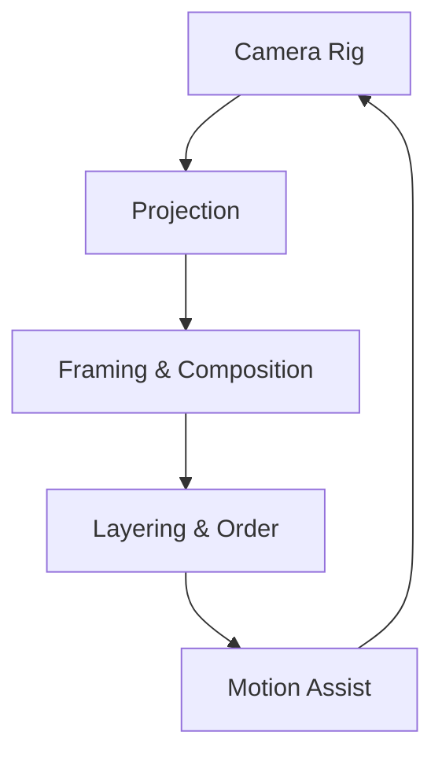
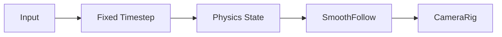

# Chapter 4 — Cameras and Navigation

Great camera work keeps players oriented while motion systems translate input into intention. This chapter walks through Bevy’s camera toolkit and movement helpers, showing how each layer builds on the last. Every vignette links to the backing example so you can peek at the code that underpins the story.



## Camera Toolkit

We begin with camera architecture. `examples/camera/custom_projection.rs` teaches how to author bespoke projection matrices so designers can experiment beyond the default perspective and orthographic options. Once the lens is chosen, `examples/camera/projection_zoom.rs` layers in zoom controls for both projection types, keeping HUD legibility and gameplay readability intact.

Composition comes next. The orbit rig in `examples/camera/camera_orbit.rs` demonstrates how pitch, yaw, and roll interplay to showcase a scene without disorienting the player. First-person projects build on that foundation using `examples/camera/first_person_view_model.rs`, which introduces near-body meshes and stabilises weapon rigs while reusing the orbit math internally.

Layering multiple views finishes the camera stack. `examples/camera/2d_on_ui.rs` renders sprites above UI panels via a second camera with a higher `order`, perfect for tactical overlays or inventory previews. When the moment calls for flair, `examples/camera/2d_screen_shake.rs` injects trauma-based camera shake, grounding the effect in easing math so intensity ramps up and decays smoothly. For top-down adventures, `examples/camera/2d_top_down_camera.rs` fuses smooth player tracking with world-space damping, creating a view that anticipates player motion instead of lagging behind.

All these patterns coexist: custom projections set the stage, layered cameras provide context, and motion effects ensure the view responds with polish.


### Game Context: Nebula Observatory
Exploration game **Nebula Observatory** blends projection tricks from `examples/camera/custom_projection.rs` with the orbit rig in `examples/camera/camera_orbit.rs`. First-person inspection switches to the setup from `examples/camera/first_person_view_model.rs`, keeping the arms visible while the projection zoom (`examples/camera/projection_zoom.rs`) tightens the field of view for detailed scans.

```rust
fn configure_observatory_camera(mut commands: Commands) {
    commands.spawn(Camera3dBundle {
        projection: Projection::Perspective(PerspectiveProjection {
            fov: 40_f32.to_radians(),
            ..default()
        }),
        ..default()
    }).insert(OrbitController::default());
}
```

#### When to Avoid It
Nebula Observatory keeps orbit and zoom controls out of cinematic cutscenes; scripted cameras use fixed transforms to avoid jerky transitions when the player bumps input devices mid-shot.

## Movement and Navigation Patterns

Camera work is only as good as the motion that feeds it. `examples/movement/physics_in_fixed_timestep.rs` synchronises player input with a fixed-step physics loop, echoing best practices from “Fix Your Timestep!” so movement stays deterministic and responsive. Once physics is solid, `examples/movement/smooth_follow.rs` shows how to ease one entity toward another—ideal for companion drones, cinematic cameras, or UI markers.

When paired together, the fixed-timestep pipeline

### Deep Dive: Fixed-Step Integration
`examples/movement/physics_in_fixed_timestep.rs` wires gameplay logic into the `FixedUpdate` schedule so movement accumulates using a constant delta. That same pattern lets you gate expensive work behind fixed intervals—Glide Runner only recomputes spline guidance when the accumulator tips over 1/60th of a second. The smooth follow helper consumes the physics state and lerps toward the target, ensuring the camera eases in even when the runner dashes.

```rust
fn smooth_drone_follow(
    time: Res<Time>,
    mut follower: Query<(&mut Transform, &FollowTarget)>,
    targets: Query<&Transform, With<Player>>
) {
    for (mut transform, follow) in &mut follower {
        if let Ok(target) = targets.get(follow.entity) {
            let lerp = follow.stiffness * time.delta_seconds();
            transform.translation = transform.translation.lerp(target.translation, lerp.min(1.0));
        }
    }
}
```

#### When to Avoid It
Avoid stuffing cosmetic systems into `FixedUpdate` just to reuse the pattern—particle sparkles and UI easing belong in the main update where delta time already matches rendering cadence.

Bevy ships these two movement references as canonical stepping stones; more specialised controllers live in plugins, so this section stays intentionally focused on the fixed-step + follower pairing. Call out community crates if you need navmeshes or spline locomotion until official samples land.

Together, the fixed-step accumulator keeps velocity integration stable while smooth follow routines add the finishing grace notes, ensuring both cameras and entities glide instead of jitter.




### Game Context: Glide Runner
Endless runner **Glide Runner** relies on a fixed-step physics loop from `examples/movement/physics_in_fixed_timestep.rs` so obstacle checks stay deterministic. A trailing drone uses the smoothing strategy from `examples/movement/smooth_follow.rs` to track the hero without jitter, feeding camera offsets back into the main rig.

```rust
fn register_fixed_update(app: &mut App) {
    app.add_systems(FixedUpdate, (advance_runner, smooth_drone_follow));
}
```

#### When to Avoid It
Glide Runner avoids fixed timesteps for purely cosmetic particle systems; those continue to run in the main update loop so they inherit whatever time dilation effects the designers layer on top.

## Practice Prompts
- Combine `examples/camera/first_person_view_model.rs` with `examples/movement/physics_in_fixed_timestep.rs` to keep a first-person rig steady even during tight physics manoeuvres.
- Use the layered approach from `examples/camera/2d_on_ui.rs` alongside the trauma-driven shake in `examples/camera/2d_screen_shake.rs` to create combat overlays that pulse with impact while leaving UI readable.
- Adapt the smooth follower in `examples/movement/smooth_follow.rs` to drive a cinematic camera that tracks the spline paths you prototyped in Chapter 3.

## Runbook
Start with these commands to experience the chapter’s highlights, then explore the remaining examples for deeper inspiration:

```
cargo run --example custom_projection
cargo run --example projection_zoom
cargo run --example camera_orbit
cargo run --example first_person_view_model
cargo run --example physics_in_fixed_timestep
cargo run --example smooth_follow
```
