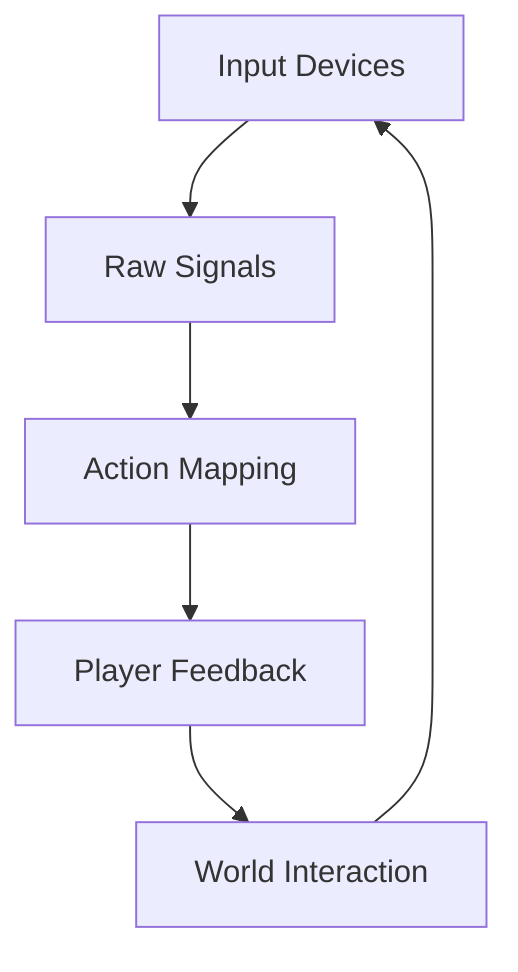
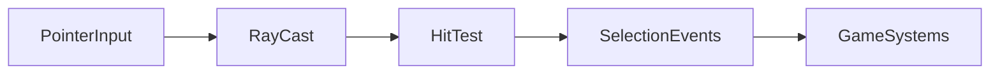

# Chapter 5 — Input and Interaction

Control schemes are conversations between hardware and gameplay. This chapter shows how Bevy’s input stack captures keyboard, mouse, touch, and gamepad intent, then extends those signals into precise picking systems for 2D and 3D worlds. Each section builds on the previous one and points to the examples that inspired it.



## Input Systems and Binding Strategies

We start at the raw edge where devices speak. `examples/input/keyboard_input.rs`, `examples/input/mouse_input.rs`, and `examples/input/touch_input.rs` demonstrate classic down/up polling, giving you immediate hooks for movement, clicks, and taps. When events need richer detail—scan codes, modifiers, or virtual keys—the event-driven counterparts (`examples/input/keyboard_input_events.rs`, `examples/input/keyboard_modifiers.rs`, `examples/input/mouse_input_events.rs`, `examples/input/touch_input_events.rs`) show how to iterate precise streams. Text-focused tools layer on `examples/input/text_input.rs`, which captures characters, manages newlines, and toggles IME support for international keyboards.

Gamepads bring yet another dialect. `examples/input/gamepad_input.rs` and `examples/input/gamepad_input_events.rs` keep you aware of connected devices and their current states, while `examples/input/gamepad_rumble.rs` feeds tactile feedback back to the player on button presses so your binding system can vibrate with intent. Console shells often need to echo characters as they arrive, a job handled cleanly by `examples/input/char_input_events.rs`.

With all these signals arriving simultaneously, focus management becomes important. `examples/input/mouse_grab.rs` demonstrates how to capture and hide the cursor during first-person play so pointer deltas remain coherent even when players swing the camera rapidly. Together, these samples teach you to treat inputs as data streams: workers subscribe to the signals they need while global action maps orchestrate the bigger picture.


### Game Context: City Sentinel Control Room
Tactical ops sim **City Sentinel** listens to keyboard, mouse, and gamepad events simultaneously. `examples/input/keyboard_input_events.rs` pipes key events into a command bus, `examples/input/mouse_grab.rs` locks the cursor during map navigation, and `examples/input/gamepad_input.rs` mirrors controls for couch co-op strategists.

```rust
fn handle_input(
    mut commands: Commands,
    mut keyboard: EventReader<KeyboardInput>,
    mut gamepads: EventReader<GamepadEvent>,
) {
    for event in keyboard.read() {
        commands.add(CommandBuffer::set_primary_order(event.key_code));
    }
    for event in gamepads.read() {
        commands.add(CommandBuffer::translate_gamepad(event));
    }
}
```

#### When to Avoid It
City Sentinel intentionally ignores raw text events in combat mode—IME overlays from `examples/input/text_input.rs` stay in chat windows only, preventing accidental focus stealing mid-encounter.

## Picking and World Interaction

Raw input finds its purpose once it touches the world. Picking begins with `examples/picking/simple_picking.rs`, which shows how to emit events whenever a pointer hovers or clicks mesh or UI entities. To help debug those flows, `examples/picking/debug_picking.rs` visualises interaction rays and toggles diagnostic overlays so designers can see exactly what the system detects.

```rust
fn highlight_hits(
    mut events: EventReader<PickingEvent>,
    mut materials: Query<&mut Handle<ColorMaterial>>
) {
    for event in events.read() {
        if let PickingEvent::Clicked(entity) = event {
            if let Ok(mut material) = materials.get_mut(*entity) {
                *material = HIGHLIGHT_MATERIAL.clone();
            }
        }
    }
}
```

The handler is adapted from `examples/picking/simple_picking.rs`, translating pick events into visual feedback so designers can see selections in real time.

Three-dimensional scenes push the concept further. `examples/picking/mesh_picking.rs` performs ray casts against mesh geometry, allowing selection of arbitrary world props, while `examples/picking/sprite_picking.rs` extends the approach to 2D sprites and sprite atlases by checking for opaque pixels. The experience becomes richer when combined with the earlier input patterns: the same bindings that grab a mouse or translate touch gestures now drive precise selection, dragging, and context menus across dimensions.




Bevy’s core repository ships these three picking samples today—simple UI, sprite, and mesh picking—so production projects often layer physics- or navmesh-aware hitscan on top.

### Game Context: Museum Architect
Design tool **Museum Architect** layers `examples/picking/mesh_picking.rs` with sprite picking (`examples/picking/sprite_picking.rs`) so curators snap props onto exhibits. Debugging uses `examples/picking/debug_picking.rs` to visualize hits, while UI overlays rely on `examples/picking/simple_picking.rs` for menu interactions.

#### When to Avoid It
The team disables picking when physics-controlled drones rearrange artifacts automatically; during those scripted sequences, ray casting would fight the automation and lead to jitter.

## Practice Prompts
- Use `examples/input/char_input_events.rs` with `examples/picking/simple_picking.rs` to create an in-game console that highlights entities as you type their names.
- Combine `examples/input/gamepad_rumble.rs` with `examples/picking/mesh_picking.rs` so controller players receive haptic feedback when they select or drag important objects.
- Pair `examples/input/mouse_grab.rs` with `examples/picking/sprite_picking.rs` to build a first-person editor that locks the cursor while still supporting precise sprite selection.

## Runbook
Run these examples to experience the chapter’s patterns first-hand, then explore the rest as your design evolves:

```
cargo run --example keyboard_input
cargo run --example mouse_input_events
cargo run --example gamepad_rumble
cargo run --example text_input
cargo run --example simple_picking
cargo run --example mesh_picking
```
