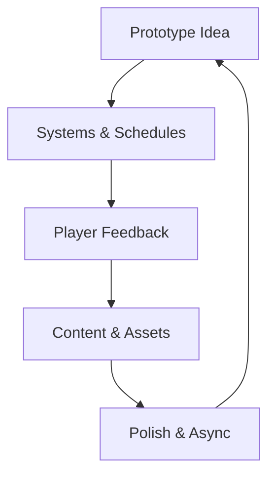
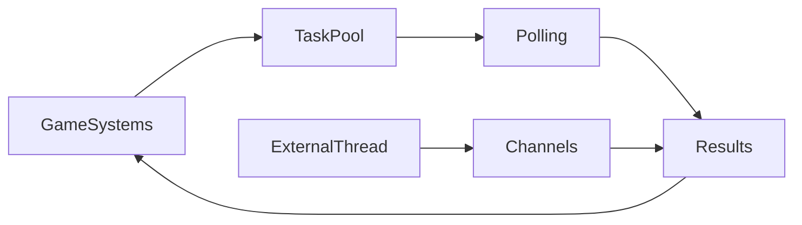

# Chapter 6 — Gameplay Blueprints

Small games reveal how Bevy’s pieces click together. This chapter dissects mini-game loops and async task patterns, tracing how input, rendering, state, and background work combine into resilient prototypes. Each beat links back to the examples so you can explore the source that inspired the story.



## Playable Mini-Games

A single loop showcases an entire ecosystem. `examples/games/alien_cake_addict.rs` keeps focus tight: player input, collision checks, and scoring all fit inside a candy-colored feedback loop, making it the perfect entry point for new programmers. For a more traditional arcade feel, `examples/games/breakout.rs` adds bricks, physics, and paddle control, doubling as a demonstration of debug stepping when the `bevy_debug_stepping` feature is enabled. Together, these examples prove that even with minimal assets, Bevy can carry a full gameplay loop.

Production teams rarely ship games without menus or flair. `examples/games/game_menu.rs` introduces a responsive UI layer with start, settings, and quit flow. It never launches a real game but shows how to bind UI events to state transitions and timer-driven previews. The moment you need to smooth out loading, `examples/games/loading_screen.rs` steps in, demonstrating how to wait for assets to become ready, render progress UI, and transition gracefully once everything is prepared.

Visual polish matters. `examples/games/desk_toy.rs` transforms the Bevy logo into a transparent desk toy with googly eyes, illustrating how playful rendering tweaks and window configuration create delightful desk companions. `examples/games/contributors.rs` turns community stats into a bouncing particle show, reminding teams that data visualisation can be playful and informative inside the same engine.

Complex projects need to inspect and debug schedules. `examples/games/stepping.rs` moves stepping systems into their own schedule so you can pause, resume, and analyse the main loop without touching gameplay code. The pattern pairs well with the debug stepping support from the Breakout sample: together they form a toolkit for studying system order and runtime flow before bugs reach production.

Taken as a whole, these mini-games teach you how to balance gameplay, UI, loading sequences, and debug affordances in a single codebase.


### Game Context: Pixel Puck Prototypes
Sports lab **Pixel Puck** starts from `examples/games/breakout.rs` to prototype new puck physics. The designers embed the menu shell from `examples/games/game_menu.rs` so testers can toggle rulesets without recompiling. Loading screens use `examples/games/loading_screen.rs` to showcase arena art as assets stream in.

#### When to Avoid It
Once mechanics solidify, Pixel Puck migrates to a dedicated gameplay crate; the mini-game structure keeps prototyping snappy but lacks the modular AI interfaces needed for the full career mode.

## Async and Background Workflows

Some workloads don’t fit inside the main tick. `examples/async_tasks/async_compute.rs` integrates Bevy’s `AsyncComputeTaskPool`, showing how to spawn heavy tasks, poll their progress each frame, and commit results back into ECS state without blocking the renderer. Meanwhile, `examples/async_tasks/external_source_external_thread.rs` spins an external thread that runs an infinite producer, communicating over channels so gameplay sees fresh data without waiting on it.



### Deep Dive: Task Polling
The compute example polls futures inside a dedicated system instead of awaiting in place. Galaxy Trader follows the same pattern: each frame it checks whether the task has produced a value and, only then, writes the result into a resource that the rest of the game consumes. The companion sample with an external thread proves that plain channels can feed the main loop without blocking rendering.

```rust
fn check_price_tasks(
    mut commands: Commands,
    mut query: Query<(Entity, &mut PriceComputation)>
) {
    for (entity, mut computation) in &mut query {
        if let Some(result) = future::block_on(future::poll_once(&mut computation.0)) {
            commands.entity(entity).despawn();
            commands.insert_resource(PriceBoard::from(result));
        }
    }
}
```

#### When to Avoid It
Spawned futures still consume memory and scheduler slots. Galaxy Trader drops stale computations the moment a player leaves a sector to avoid piling up expensive tasks that will never influence gameplay.

These patterns empower live-service features—background matchmaking, procedural generation, telemetry uploads—while keeping frame times stable. Blend them with the mini-game scaffolds and you can stream new levels, update leaderboards, or animate desk toys based on external data without introducing stalls.

Bevy currently ships two canonical async samples—`async_compute` for task-pool work and `external_source_external_thread` for channel bridges—so this section focuses on the core handshake between pools and the main schedule. As additional async patterns stabilize, slot them here to broaden coverage.


### Game Context: Galaxy Trader Network
MMO-lite **Galaxy Trader** queues background price simulations using `examples/async_tasks/async_compute.rs`. When the game connects to the community market, the bridge built from `examples/async_tasks/external_source_external_thread.rs` streams remote price updates through channels without freezing the render thread.

```rust
fn spawn_price_task(mut commands: Commands, pool: Res<AsyncComputeTaskPool>) {
    let task = pool.spawn(async move { calculate_new_prices().await });
    commands.spawn(PriceComputation(task));
}
```

#### When to Avoid It
The team keeps combat resolution out of async tasks; battle outcomes feed directly into moment-to-moment gameplay and must remain deterministic inside the main schedule.

## Practice Prompts
- Extend `examples/games/game_menu.rs` to launch `examples/games/alien_cake_addict.rs`, then return gracefully using the stepping approach from `examples/games/stepping.rs`.
- Feed the scene in `examples/games/contributors.rs` with data streamed from `examples/async_tasks/external_source_external_thread.rs`, updating bouncing avatars as the external thread reports changes.
- Integrate `examples/async_tasks/async_compute.rs` into `examples/games/breakout.rs` to offload level generation or score calculation without disrupting paddle responsiveness.

## Runbook
Start with these commands to experience the chapter, then branch into the remaining samples as inspiration strikes:

```
cargo run --example alien_cake_addict
cargo run --example breakout
cargo run --example game_menu
cargo run --example loading_screen
cargo run --example async_compute
cargo run --example external_source_external_thread
```
