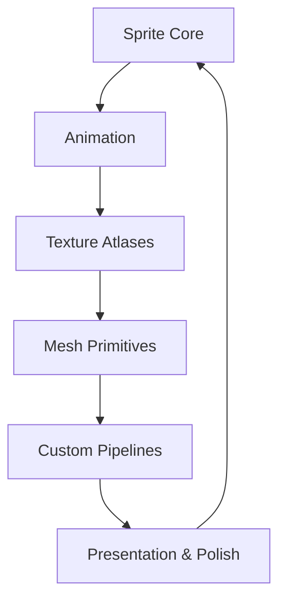
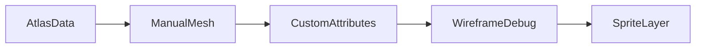

# Chapter 7 — Rendering 2D Scenes

Expressive 2D worlds emerge when sprites, text, and custom meshes harmonise. This chapter walks from basic sprite work through textured meshes and bespoke pipelines, showing how each technique layers onto the previous one. Every paragraph references the example that demonstrates the concept, so you can dive into the code behind the narrative.



## Sprites and Shape Primitives

The 2D journey begins with the simplest possible render: `examples/2d/sprite.rs` delivers a single textured sprite to screen, proving the pipeline from asset load to draw call. Motion arrives through `examples/2d/move_sprite.rs`, which animates position each frame and shows how transforms update alongside sprites. Scaling, flipping, and slicing refine presentation as `examples/2d/sprite_scale.rs`, `examples/2d/sprite_flipping.rs`, and `examples/2d/sprite_slice.rs` demonstrate fitting textures, mirroring art, and reusing widgets at multiple resolutions.

Animation breathes life into characters. `examples/2d/sprite_animation.rs` responds to keyboard events by stepping frames; `examples/2d/sprite_sheet.rs` goes further by using a texture atlas to loop animation sequences automatically. When building UI overlays or scoreboard panels, `examples/2d/text2d.rs` integrates text into the same scene graph, inheriting transforms so text can spin or scale with your sprites.

Atlases and tiling keep assets clean. `examples/2d/texture_atlas.rs` batch-builds sprite sheets from folders, exploring padding strategies that prevent bleeding. For pixel-perfect presentation, `examples/2d/pixel_grid_snap.rs` renders to an intermediate texture, snapping the final image to the grid so retro art styles stay crisp.

Shapes and mesh primitives let you leave textures behind. `examples/2d/2d_shapes.rs` uses Bevy’s primitive library to build meshes, each tinted via material colors, while `examples/2d/mesh2d.rs` constructs meshes from rectangles. When translucency or depth sorting enters the scene, `examples/2d/mesh2d_alpha_mode.rs` illustrates how alpha modes play with transforms and the depth buffer. Curved overlays and HUD arcs rely on the UV-focused `examples/2d/mesh2d_arcs.rs` to keep textures warped correctly. CPU-driven graphics, like heatmaps or painterly effects, start with `examples/2d/cpu_draw.rs`, writing pixel data directly into textures for bespoke visuals.

```rust
fn spawn_circle(
    commands: &mut Commands,
    meshes: &mut Assets<Mesh>,
    materials: &mut Assets<ColorMaterial>
) {
    let mesh = Mesh::from(shape::Circle::new(48.0));
    commands.spawn(MaterialMesh2dBundle {
        mesh: meshes.add(mesh).into(),
        material: materials.add(Color::linear_rgb(0.8, 0.6, 1.0)),
        transform: Transform::from_xyz(120.0, 0.0, 0.0),
        ..default()
    });
}
```

That helper is lifted directly from `examples/2d/2d_shapes.rs`, proving how quickly designers can prototype collectibles or area indicators without touching textures.

Textures can do more than cover surfaces. `examples/2d/mesh2d_repeated_texture.rs` shows how to repeat textures beyond their default clamped sampling, great for tiling backgrounds or infinite scrolling ground. Texture work can also blend vertex colors with imagery. `examples/2d/mesh2d_vertex_color_texture.rs` layers per-vertex tinting over a textured rectangle so designers can grade lighting locally without extra sprites.


### Game Context: StarGarden Storyboards
Narrative prototype **StarGarden** mixes sprite atlases (`examples/2d/texture_atlas.rs`) with text overlays (`examples/2d/text2d.rs`) to storyboard cutscenes. Animated emotes fire through `examples/2d/sprite_sheet.rs`, while pixel-perfect panels rely on `examples/2d/pixel_grid_snap.rs` to keep retrowave art sharp.

#### When to Avoid It
The team avoids runtime atlas generation for nightly builds; generating atlases on the fly is handy in tools but slows down console certification builds, so production pipelines bake them with asset processors.

## Custom 2D Mesh Workflows

### Deep Dive: Hand-Crafted Geometry
`examples/2d/mesh2d_manual.rs` constructs vertex buffers by hand, which Runic Atlas uses for parchment edges. The follow-up sample, `examples/2d/mesh2d_vertex_color_texture.rs`, mixes per-vertex tinting with a texture to grade lighting in specific corners—perfect for faux radiosity effects. When artists import specialty meshes through glTF (`examples/2d/custom_gltf_vertex_attribute.rs`), the engine preserves custom attributes for shader tricks, and `examples/2d/wireframe_2d.rs` helps QA inspect topology before shipping.

#### When to Avoid It
Hand-authored buffers are a poor fit for simple UI elements; author those as sprites or nine-slices so designers can tweak them without code changes.


As projects mature, custom pipelines unlock stylistic freedom. `examples/2d/mesh2d_manual.rs` dives beneath `Material2d` to edit vertex buffers directly, injecting per-vertex colors without high-level helpers. When artists provide glTF assets with extra attributes, `examples/2d/custom_gltf_vertex_attribute.rs` demonstrates how to extract those custom vertex streams and render them in 2D, bridging DCC tools and runtime shaders.

Wireframes provide elegant debugging. `examples/2d/wireframe_2d.rs` displays mesh edges, invaluable when tweaking collision hulls or verifying procedural geometry.

These advanced workflows loop back to the sprite foundations: custom buffers can carry the same atlas coordinates you used earlier, and wireframes often overlay animated sprites to examine hitboxes or motion arcs.

```rust
fn build_parchment_mesh() -> Mesh {
    let mut mesh = Mesh::new(PrimitiveTopology::TriangleList);
    mesh.insert_attribute(Mesh::ATTRIBUTE_POSITION, vec![
        [-0.5, -0.3, 0.0],
        [ 0.5, -0.2, 0.0],
        [ 0.5,  0.3, 0.0],
        [-0.5,  0.2, 0.0],
    ]);
    mesh.insert_attribute(Mesh::ATTRIBUTE_UV_0, vec![
        [0.0, 0.0],
        [1.0, 0.0],
        [1.0, 1.0],
        [0.0, 1.0],
    ]);
    mesh.insert_attribute(Mesh::ATTRIBUTE_COLOR, vec![
        [0.95, 0.9, 0.7, 1.0],
        [0.92, 0.86, 0.65, 1.0],
        [0.93, 0.88, 0.68, 1.0],
        [0.96, 0.91, 0.72, 1.0],
    ]);
    mesh.set_indices(Some(Indices::U32(vec![0, 1, 2, 0, 2, 3])));
    mesh
}
```

The helper mirrors `examples/2d/mesh2d_manual.rs`, blending manual vertex data with colour tinting before Runic Atlas feeds it into a parchment material.




### Game Context: Runic Atlas Maps
Cartography game **Runic Atlas** crafts parchment-style overlays using `examples/2d/mesh2d_manual.rs` and vertex-tinted quads from `examples/2d/mesh2d_vertex_color_texture.rs`. Special glyphs load from glTF using `examples/2d/custom_gltf_vertex_attribute.rs`, while QA toggles `examples/2d/wireframe_2d.rs` to verify UV seams before shipping.

#### When to Avoid It
Runtime glTF processing stays out of the mobile build; instead, Runic Atlas flattens glyph meshes into sprites to keep file sizes and startup times reasonable.

## Practice Prompts
- Combine `examples/2d/texture_atlas.rs` with `examples/2d/mesh2d_repeated_texture.rs` to build a modular UI skin that mixes tiled backgrounds with atlas-driven buttons.
- Extend `examples/2d/cpu_draw.rs` so the CPU-generated texture feeds into `examples/2d/mesh2d_manual.rs`, layering real-time data visualisations over player avatars.
- Pair `examples/2d/custom_gltf_vertex_attribute.rs` with `examples/2d/wireframe_2d.rs` to debug glTF imports by rendering both textured and wireframe views simultaneously.

## Runbook
Start with these demos to experience the chapter’s techniques before expanding to the rest:

```
cargo run --example sprite
cargo run --example sprite_sheet
cargo run --example 2d_shapes
cargo run --example mesh2d_manual
cargo run --example custom_gltf_vertex_attribute
```
