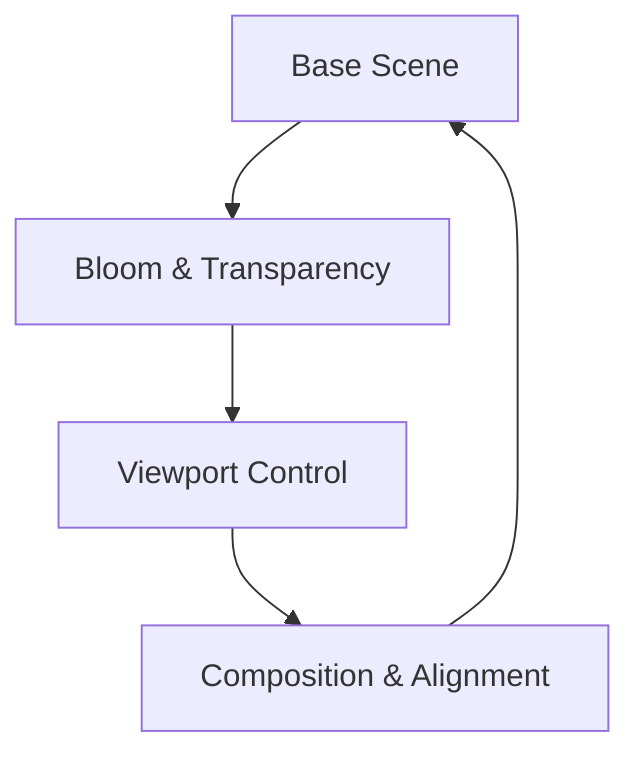
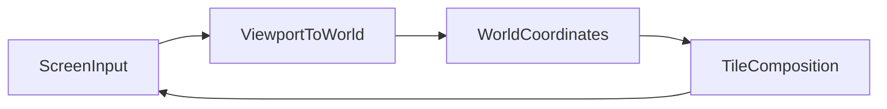

# Chapter 8 — 2D Effects and Camera Tricks

Polish transforms good presentation into great presence. This chapter builds on the rendering foundations to add bloom, transparency, and precise camera utilities. The narrative links directly to the examples so you can inspect the implementations while imagining how they fit into your own projects.



## 2D Lighting and Post-Processing

### Deep Dive: Balancing Bloom and Alpha
`examples/2d/bloom_2d.rs` exposes bloom settings that Night Parade animates alongside trauma values, while `examples/2d/transparency_2d.rs` reveals how depth ordering interacts with alpha. Combined, they provide a playbook for building layered VFX without sacrificing readability.

#### When to Avoid It
If readability is paramount—think esports overlays—disable bloom during replays so the video encode stays crisp.


Visual glue begins with bloom. `examples/2d/bloom_2d.rs` layers high-intensity sprites and applies the bloom compositor to the 2D pipeline, softening highlights into a glow that immediately elevates UI elements, explosions, or magic spells. Pair bloom with thoughtful transparency using `examples/2d/transparency_2d.rs`, which stacks three Bevy logos at varying alpha values to showcase additive blending and depth ordering in a 2D context.

Together, these techniques teach you how to direct the player’s eye: bloom emphasises focal points while transparency lets UI and scene elements overlap without muddying the view. 

These are the two 2D VFX references shipping with core Bevy today; community shaders handle stylised outlines or CRT filters. Call out your favourites in this chapter’s margin when the engine graduates more effects into the examples tree.


### Game Context: Night Parade
Action roguelite **Night Parade** leans on `examples/2d/bloom_2d.rs` to give lantern trails a dreamy glow. Trauma-driven screen shake from `examples/camera/2d_screen_shake.rs` synchronizes with bloom intensity, while `examples/2d/transparency_2d.rs` layers ghostly spirits over the scene without destroying readability.

```rust
fn apply_lantern_shine(mut bloom_settings: ResMut<BloomSettings>, trauma: Res<Trauma>) {
    bloom_settings.intensity = 0.8 + trauma.current() * 0.4;
}
```

#### When to Avoid It
Night Parade disables bloom in competitive leaderboard replays to keep bitrate low and avoid distracting glare when players analyze routes frame-by-frame.

## Camera and Viewport Utilities in 2D

### Deep Dive: Coordinate Conversion
`examples/2d/2d_viewport_to_world.rs` highlights how camera zoom and viewport resizing influence world picks. City Block Planner clamps the conversion to the build grid, and the tiling helper from `examples/2d/sprite_tile.rs` keeps overlays aligned regardless of screen size.

#### When to Avoid It
HUD buttons stay in screen space; running them through viewport_to_world complicates math without adding value when they never leave the UI layer.


Once the scene sparkles, the camera must frame it carefully. `examples/2d/2d_viewport_to_world.rs` shows how to convert viewport coordinates into world positions even as the camera zooms or pans, making it the backbone of accurate selection, drag, and placement tools. Complement that utility with `examples/2d/sprite_tile.rs`, which tiles a sprite across a grid and animates scale—ideal for parallax backdrops or tactical overlays that need to stay in sync with world coordinates.



By combining these camera helpers with the bloom and transparency pipeline, you can craft layered 2D scenes that remain readable and responsive regardless of zoom level or viewport changes. 

Bevy’s sample set keeps 2D camera utilities lean—viewport conversion and sprite tiling cover the fundamentals while you reach for community add-ons if you need full pathfinding overlays or minimap projection.


### Game Context: City Block Planner
Builder sim **City Block Planner** converts cursor positions to world coordinates with `examples/2d/2d_viewport_to_world.rs`, letting players paint zoning overlays precisely. `examples/2d/sprite_tile.rs` tiles utility overlays across the grid so color-coded information scales with zoom level.

#### When to Avoid It
For small HUD widgets the team falls back to screen-space calculations—running everything through viewport math would complicate simple UI buttons.

## Practice Prompts
- Blend `examples/2d/bloom_2d.rs` with `examples/2d/sprite_tile.rs` to create a glowing parallax background that follows camera zoom without exposing seams.
- Extend `examples/2d/transparency_2d.rs` so transparent overlays respond to world-space mouse coordinates using the conversion technique from `examples/2d/2d_viewport_to_world.rs`.
- Use the viewport-to-world mapping to let players drag windows or deploy abilities on a tiled, animated battlefield inspired by `examples/2d/sprite_tile.rs`.

## Runbook
Kick off your exploration with these commands, then integrate the ideas into your own scenes:

```
cargo run --example bloom_2d
cargo run --example transparency_2d
cargo run --example 2d_viewport_to_world
cargo run --example sprite_tile
```
