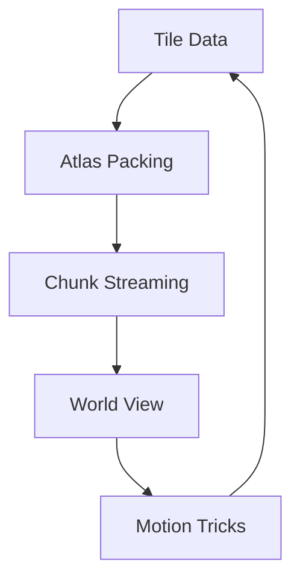
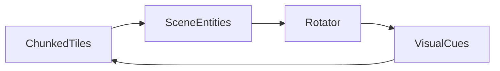

# Chapter 9 — Tilemaps and Specialized 2D Tricks

Tile-based worlds rely on disciplined data flow, while one-off rendering tricks keep those worlds lively. This chapter pairs Bevy’s tilemap chunking pattern with a rotation helper that injects motion into otherwise static scenes. As always, each concept points to the example that delivers the implementation.



## Tilemaps, Atlases, and Grids

### Deep Dive: Streamed Chunks
`examples/2d/tilemap_chunk.rs` batches tiles into mesh chunks so Chronicle Tactics streams megadungeons without blowing the draw-call budget. Designers iterate on a single chunk at a time, then stitch them together as players explore.

#### When to Avoid It
Tiny puzzle arenas load the entire grid at once—chunk management adds overhead when the whole scene fits comfortably in memory.


Large 2D environments demand efficiency. `examples/2d/tilemap_chunk.rs` demonstrates how to batch tiles into chunks rendered with a single draw call. By organising tiles into grid-aligned sections and feeding them through a shared material, your world streams smoothly while memory stays manageable. The example also hints at how metadata—such as collision or biomes—can travel alongside tile indices so gameplay systems and rendering stay in lockstep.

Armed with this pattern, you can stream regions in and out as players explore, apply atlas changes on the fly, or precompute lighting data per chunk without stalling the frame.

```rust
fn spawn_chunk(commands: &mut Commands, chunk: TileChunk) {
    commands.spawn(TilemapBundle {
        tilemap: chunk.tilemap_id(),
        texture: chunk.atlas(),
        transform: Transform::from_translation(chunk.world_origin()),
        ..default()
    });
}
```

The call mirrors `examples/2d/tilemap_chunk.rs`, where each chunk carries its atlas handle and translation so Chronicle Tactics can stream them on demand.


Bevy ships tilemap_chunk as the primary canonical tile-streaming sample today; most teams layer custom tooling on top, so this section stays narrow and points to community crates when navmesh or autotiling extensions are required.

### Game Context: Chronicle Tactics Editor
Strategy title **Chronicle Tactics** chunk-streams battle maps using `examples/2d/tilemap_chunk.rs`. Designers split large dungeons into streamed chunks so they can author thousand-tile arenas without tanking frame time.

#### When to Avoid It
Small puzzle arenas load the entire map at once; chunk streaming adds bookkeeping that isn’t worth it when the stage fits comfortably in memory.

## Specialized 2D Techniques

### Deep Dive: Runtime Adjustments
`examples/2d/cpu_draw.rs` pairs nicely with rotation helpers when Lantern Fest paints animated props straight into textures before uploading them to the GPU.

#### When to Avoid It
CPU-side drawing is best for occasional updates—redrawing every frame in software will tank performance compared to sprite-based animations.


Tile worlds feel alive when even simple props and markers move with purpose. `examples/2d/rotation.rs` spins entities using quaternions, illustrating how to rotate sprites smoothly without skewing transforms. This trick slots neatly into tile-based projects: rotating windmills, radar dishes, or animated pointers adds motion cues that orient players while keeping geometry aligned.




### Game Context: Lantern Fest Cutscenes
Story moments in **Lantern Fest** rotate props with `examples/2d/rotation.rs` to simulate gentle breezes atop the static tile grid.

#### When to Avoid It
Lantern Fest keeps continuous rotation out of physics-bound objects; when collisions matter, rotation is handled by the physics engine to avoid discrepancies between visuals and gameplay.

This section trails the single rotation helper that ships with core Bevy today; treat it as a springboard and catalogue your own texture tricks until more specialized samples graduate into the repository.

## Practice Prompts
- Extend `examples/2d/tilemap_chunk.rs` to add animated props that reuse the quaternion rotation from `examples/2d/rotation.rs`, highlighting points of interest on the map.
- Annotate tile metadata with rotation targets so that when a tile loads, a companion entity spins using the pattern from `examples/2d/rotation.rs`.

## Runbook
Jump in with the following commands before adapting the ideas to your own maps:

```
cargo run --example tilemap_chunk
cargo run --example rotation
```
