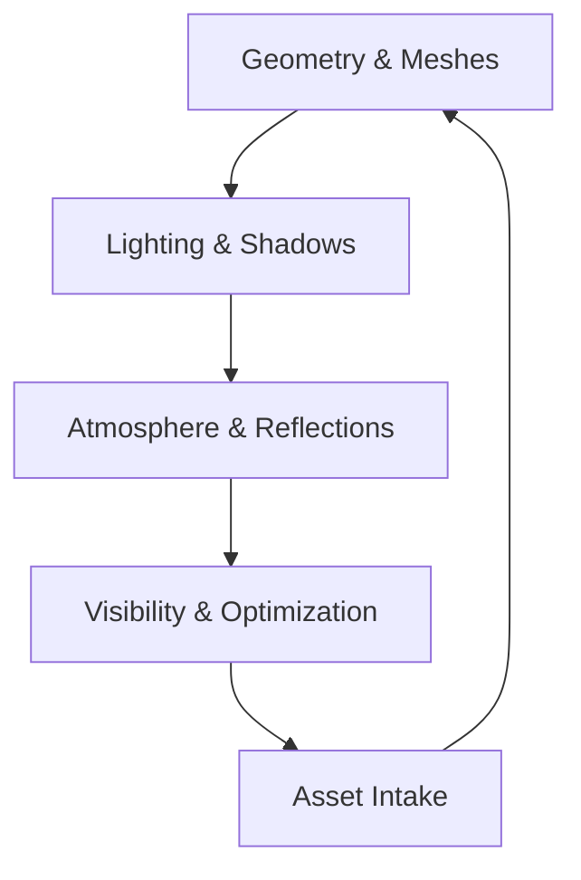
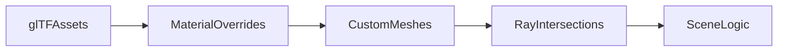

# Chapter 10 — Building 3D Scenes

Three-dimensional worlds lean on careful assembly: lighting, materials, visibility controls, and asset pipelines all need to co-operate. This chapter shows how Bevy’s scene fundamentals come together, layering basic geometry, lighting, and glTF workflows into a cohesive production-ready toolkit. Each step in the story links to the examples that illustrate the concepts.



## Scene Assembly and Visibility

We anchor the chapter with `examples/3d/3d_scene.rs`, a cube and plane under directional light—your first proof that meshes, lights, and cameras align. Swap primitives from the math library via `examples/3d/3d_shapes.rs` to populate scenes with spheres, capsules, and more, each with runtime-generated textures. Material control deepens with `examples/3d/manual_material.rs`, where you handcraft material properties and watch the lighting model respond.

Lighting defines mood. `examples/3d/lighting.rs` cycles through different light types and colors, while `examples/3d/shadow_caster_receiver.rs` and `examples/3d/shadow_biases.rs` teach how to tune which meshes cast or receive shadows and how bias values prevent acne or peter-panning. For indirect lighting, `examples/3d/irradiance_volumes.rs` shows how light probes enrich global illumination, and `examples/3d/lightmaps.rs` demonstrates baking lightmaps for static geometry.

Atmospheric touches keep scenes believable. `examples/3d/fog.rs` adds distance-based fog for mood and performance, while `examples/3d/reflection_probes.rs` captures localized reflections. SSAO adds contact shadowing via `examples/3d/ssao.rs`, and bloom-like camera adaptation arrives through `examples/3d/auto_exposure.rs`, which mimics how human eyes adapt to brightness.

Visibility and blending challenges appear once scenes grow complex. When transparency order matters, `examples/3d/order_independent_transparency.rs` employs OIT to maintain correct compositing. High-density scenes stay fast with `examples/3d/meshlet.rs`, showcasing meshlet rendering, and `examples/3d/visibility_range.rs` demonstrates hiding distant objects with hierarchical LOD ranges.

Assets flow through glTF pipelines: `examples/3d/load_gltf.rs` loads an entire scene, while `examples/3d/load_gltf_extras.rs` reveals how to inspect extras metadata.

```rust
fn swap_materials(
    mut materials: ResMut<Assets<StandardMaterial>>,
    query: Query<&Handle<StandardMaterial>, With<GltfTag>>
) {
    for handle in &query {
        if let Some(mat) = materials.get_mut(handle) {
            mat.base_color = Color::srgba(0.2, 0.6, 1.0, 1.0);
        }
    }
}
```

Straight from `examples/3d/edit_material_on_gltf.rs`, this helper shows how Odyssey Forge tweaks imported assets after loading. Runtime tweaks come from `examples/3d/edit_material_on_gltf.rs`, which swaps materials post-load, and `examples/3d/update_gltf_scene.rs`, which attaches glTF scenes to existing entities or iterates spawned entities for selective edits. When you need material-level queries, `examples/3d/query_gltf_primitives.rs` digs into primitives to find `StandardMaterial` handles.

Finally, parallax and ray-based interactions add feel. `examples/3d/parallax_mapping.rs` applies depth-enhanced materials to a spinning cube, while `examples/3d/mesh_ray_cast.rs` (covered later in the chapter) demonstrates surface-aware raycasts.


### Game Context: Odyssey Forge Environments
Open-world RPG **Odyssey Forge** starts with `examples/3d/3d_scene.rs` to scaffold biomes, then layers dynamic lighting via `examples/3d/lighting.rs`. Auto exposure from `examples/3d/auto_exposure.rs` softens transitions between caves and sunlit fields, while `examples/3d/visibility_range.rs` culls distant props. Artists preview baked GI with `examples/3d/lightmaps.rs` before exporting final builds.

#### When to Avoid It
For hero set pieces the team locks exposure values; automated adaptation can wash out art-directed lighting in cinematics.

## Importing and Editing glTF Content

Production assets usually arrive via glTF. `examples/3d/anisotropy.rs` highlights how advanced material features—like anisotropic shading—are preserved from the source. Proceduralists can mix handmade geometry with `examples/3d/generate_custom_mesh.rs`, crafting custom UV mappings and mutating them at runtime for dynamic effects such as animated billboards or morphs.

Interaction systems lean on geometry awareness. `examples/3d/mesh_ray_cast.rs` chains ray casts and surface bounces, enabling laser scans, bullet ricochets, or surface painting. Set alongside the glTF import workflow, it shows how runtime geometry and imported meshes are equally addressable.




### Game Context: Asset QA Pipeline
The content team reviews submissions using `examples/3d/load_gltf.rs` and `examples/3d/query_gltf_primitives.rs` to inspect materials. If a shader needs tweaking, `examples/3d/edit_material_on_gltf.rs` overrides values on the fly. Procedural props originate from `examples/3d/generate_custom_mesh.rs`, while raycast checks from `examples/3d/mesh_ray_cast.rs` validate collider coverage.

```rust
fn tint_submesh(
    mut materials: ResMut<Assets<StandardMaterial>>,
    query: Query<&Handle<StandardMaterial>, With<NeedsTint>>
) {
    for handle in &query {
        if let Some(mat) = materials.get_mut(handle) {
            mat.base_color = Color::srgba(0.9, 0.4, 0.4, 1.0);
        }
    }
}
```

#### When to Avoid It
Runtime material edits stay out of competitive multiplayer; instead, Odyssey Forge bakes approved materials into asset bundles to keep clients deterministic.

## Practice Prompts
- Load a glTF scene using `examples/3d/load_gltf.rs`, then override its materials with the approach from `examples/3d/edit_material_on_gltf.rs` while toggling shadow casting via `examples/3d/shadow_caster_receiver.rs`.
- Use `examples/3d/visibility_range.rs` to manage far-distance culling, blending in `examples/3d/fog.rs` so distant geometry fades gracefully.
- Combine `examples/3d/meshlet.rs` with `examples/3d/mesh_ray_cast.rs` to test ray-based interactions against high-density meshes without sacrificing frame rate.

## Runbook
Launch these samples to see the chapter’s ideas firsthand, then explore the remainder as your project needs them:

```
cargo run --example 3d_scene
cargo run --example lighting
cargo run --example fog
cargo run --example load_gltf
cargo run --example edit_material_on_gltf
cargo run --example mesh_ray_cast
```
