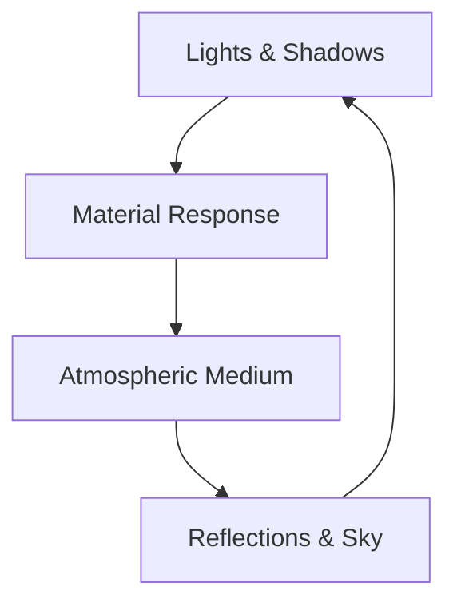
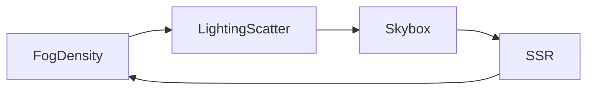

# Chapter 11 — Lighting and Atmosphere

Lighting defines mood; atmosphere sustains it. This chapter shows how Bevy’s lighting stack—spotlights, area lights, soft shadows, and transmission—connects seamlessly with fog, skyboxes, and screen-space techniques so a scene can breathe. Each vignette references the example that powers the idea.



## Lighting, Shadows, and Exposure

Start with the playbook for varied fixtures. `examples/3d/spotlight.rs` demonstrates tight-beam spotlights that direct attention, while `examples/3d/spherical_area_lights.rs` widens coverage with radius-sensitive point lights. Texture-driven lights beam silhouettes via `examples/3d/light_textures.rs`, perfect for stained glass or projector effects. Mixed pipelines surface through `examples/3d/mixed_lighting.rs`, which merges baked and dynamic lighting so static props bask in precomputed GI while dynamic actors keep their own shadows.

Softness and realism come from shadow tuning. `examples/3d/pcss.rs` explores percentage-closer soft shadows, showing how filter kernel sizes shape penumbras. When you need advanced control, `examples/3d/solari.rs` introduces Bevy Solari for real-time ray-traced lighting, letting you experiment with physically based shadows on high-end hardware. Materials respond to light in nuanced ways: `examples/3d/transmission.rs` illustrates subsurface transmission controls, giving skin, wax, or leaves believable backlighting with adjustable thickness and roughness.

Combine these techniques and you can layer directional, spot, and area lights while adjusting softness and transmission to fit any art direction, from stylised dioramas to photorealistic vignettes.

```rust
fn setup_arena_lights(mut commands: Commands) {
    commands.spawn(PointLightBundle {
        point_light: PointLight {
            intensity: 5_000.0,
            radius: 6.0,
            shadows_enabled: true,
            ..default()
        },
        transform: Transform::from_xyz(0.0, 8.0, 0.0),
        ..default()
    });
    commands.spawn(SpotLightBundle {
        spot_light: SpotLight {
            intensity: 12_000.0,
            outer_angle: 35.0f32.to_radians(),
            ..default()
        },
        transform: Transform::from_xyz(4.0, 6.5, 2.0)
            .looking_at(Vec3::ZERO, Vec3::Y),
        ..default()
    });
}
```

Lifted from `examples/3d/spherical_area_lights.rs` and `examples/3d/spotlight.rs`, this scaffold shows how Solstice Arena mixes fixtures before layering on PCSS and transmission settings.


### Game Context: Solstice Arena
Arena brawler **Solstice Arena** mixes spotlights (`examples/3d/spotlight.rs`) with area lights (`examples/3d/spherical_area_lights.rs`) to dramatise fights. PCSS soft shadows from `examples/3d/pcss.rs` soften edges, and transmission controls (`examples/3d/transmission.rs`) make crystal shields glow when backlit. On high-end PCs, the team experiments with `examples/3d/solari.rs` for ray-traced accents.

#### When to Avoid It
Switch builds skip the Solari pipeline; ray tracing eats too much GPU budget on handheld hardware, so the fallback relies on baked lighting.

## Atmosphere, Fog, and Environment Maps

Lighting isn’t complete until it meets air. `examples/3d/atmospheric_fog.rs` and `examples/3d/volumetric_fog.rs` step beyond simple distance fog: atmospheric fog spreads an aerial perspective across the scene, and volumetric fog threads light shafts through god rays. Fog becomes malleable in `examples/3d/fog_volumes.rs`, where density textures sculpt fog volumes—here the Stanford bunny—inside the world.

For planetary vibes, `examples/3d/atmosphere.rs` simulates PBR atmospheric scattering, giving sky gradients and horizon glow that react to sun position. Skyboxes stay dynamic thanks to `examples/3d/skybox.rs`, which loads cubemaps and cycles compressed formats, while `examples/3d/rotate_environment_map.rs` keeps environment reflections locked when you rotate the sky. To ensure reflections capture screen-space details, `examples/3d/ssr.rs` enables screen-space reflections, blending them with other sources for glossy surfaces.

Motion adds life. `examples/3d/scrolling_fog.rs` scrolls fog density textures over time, making weather systems drift realistically.

```rust
fn animate_fog(mut volumes: Query<&mut FogVolumeModifier>, time: Res<Time>) {
    for mut volume in &mut volumes {
        volume.offset += Vec3::new(0.0, 0.0, time.delta_seconds() * 0.1);
    }
}
```

The loop mirrors `examples/3d/scrolling_fog.rs`, nudging fog volume offsets each frame so Skydome Sagas’ weather drifts believably.




Bevy’s atmosphere catalogue currently covers scattering, fog volumes, and SSR—the handful of samples you see here—so plan to extend with custom shaders if you need weather systems beyond scrolling fog or precomputed cubemaps.

### Game Context: Skydome Sagas
Exploration epic **Skydome Sagas** renders planetary vistas using `examples/3d/atmosphere.rs` for sky gradients and `examples/3d/volumetric_fog.rs` for god rays. Weather systems scroll fog densities via `examples/3d/scrolling_fog.rs`, while rotating HDRI maps (`examples/3d/rotate_environment_map.rs`) keep reflections aligned with the passing sun. Screen-space reflections from `examples/3d/ssr.rs` tie shiny armor back to the current skybox.

#### When to Avoid It
SSR is disabled in photo mode when artists demand deterministic reflections; they swap to baked reflection probes to prevent temporal artifacts in high-resolution captures.

## Practice Prompts
- Pair `examples/3d/pcss.rs` with `examples/3d/volumetric_fog.rs` to soften shadows while letting god rays pierce the fog.
- Combine `examples/3d/transmission.rs` with `examples/3d/scrolling_fog.rs` to light semi-translucent foliage that sways within moving fog banks.
- Rotate environment maps with `examples/3d/rotate_environment_map.rs` while using screen-space reflections from `examples/3d/ssr.rs` to keep metallic surfaces grounded in the current sky.

## Runbook
Experience the lighting toolkit first-hand using the commands below, then weave the techniques together in your scenes:

```
cargo run --example spotlight
cargo run --example spherical_area_lights
cargo run --example pcss
cargo run --example transmission
cargo run --example volumetric_fog
cargo run --example ssr
```
