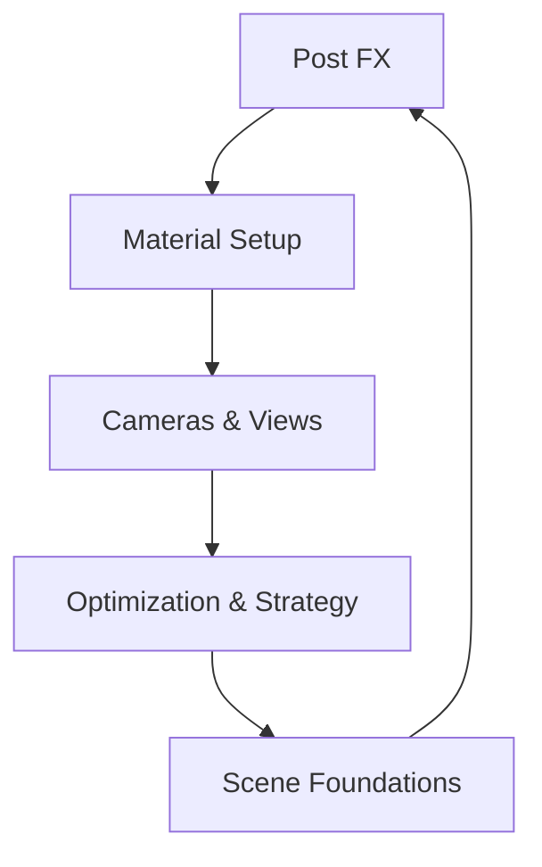
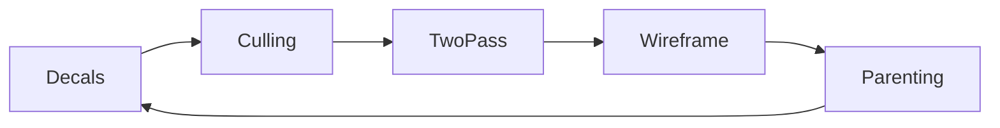

# Chapter 12 — Rendering Tactics

When cinematic polish, material control, and performance all matter, Bevy’s rendering tactics shine. This chapter layers post-processing, material workflows, camera mastery, and optimization strategies into a single mental model. Each segment references the examples that demonstrate the technique.



## Post-Processing and Camera Effects

We begin at the screen’s final mile. `examples/3d/bloom_3d.rs` shows HDR bloom that makes emissive materials radiate, while `examples/3d/depth_of_field.rs` blurs out-of-focus planes for cinematic focus pulls. `examples/3d/motion_blur.rs` adds per-object trails, ideal for fast-moving rigs, and `examples/3d/post_processing.rs` layers chromatic aberration for stylised edges. Color management gets interactive with `examples/3d/color_grading.rs`, letting art teams tweak scene tonality in real time.

Anti-aliasing comparisons in `examples/3d/anti_aliasing.rs` and tonemapping options in `examples/3d/tonemapping.rs` round out display tuning. Blend modes influence compositing—`examples/3d/blend_modes.rs` and `examples/3d/transparency_3d.rs` show how varying alpha, additive, and multiply behaviours affect surfaces—while `examples/3d/vertex_colors.rs` illustrates how vertex colors contribute to final render passes.


### Game Context: Neon Heist
Stealth thriller **Neon Heist** combines bloom (`examples/3d/bloom_3d.rs`) with per-object motion blur (`examples/3d/motion_blur.rs`) to highlight high-speed escapes. Color grading controllers (`examples/3d/color_grading.rs`) let directors shift palettes between mission phases, and chromatic aberration (`examples/3d/post_processing.rs`) accentuates hacking overlays.

#### When to Avoid It
Competitive speedrunners can toggle these effects off; excessive bloom or aberration makes hitboxes harder to read during precise stealth challenges.

## Materials and Surface Shading

Post effects shine brightest when materials respond believably. `examples/3d/pbr.rs` guides you through PBR parameters—albedo, roughness, metallicity—while `examples/3d/specular_tint.rs` and `examples/3d/clearcoat.rs` add specular nuances and layered clearcoat reflections. Animating materials via `examples/3d/animated_material.rs` brings life to holograms, billboards, or pulsating energy. `examples/3d/texture.rs` covers texture configuration, from samplers to normal maps, and `examples/3d/lines.rs` crafts a custom material to draw precise 3D lines.

Rendering back into textures opens new possibilities. `examples/3d/render_to_texture.rs` captures scenes into off-screen targets for mirrors, UI widgets, or compositing. Combined with material animation, you can project live feeds onto in-world screens or adjust HUD elements on the fly.


### Game Context: Stellar Bazaar
Marketplace sim **Stellar Bazaar** showcases exotic materials using `examples/3d/specular_tint.rs`, `examples/3d/clearcoat.rs`, and animated shaders from `examples/3d/animated_material.rs`. Vendors embed live feeds into holograms using `examples/3d/render_to_texture.rs`.

```rust
fn update_hologram(
    mut materials: ResMut<Assets<StandardMaterial>>,
    query: Query<&Handle<StandardMaterial>, With<Hologram>>
) {
    for handle in &query {
        if let Some(mat) = materials.get_mut(handle) {
            mat.emissive = Color::srgba(0.1, 0.6, 1.0, 1.0);
        }
    }
}
```

#### When to Avoid It
The Switch version swaps animated materials for baked flipbooks to keep shader complexity within budget.

## Advanced Camera Workflows in 3D

Camera control frames the artistry. `examples/3d/orthographic.rs` demonstrates iso-friendly orthographic views, while `examples/3d/3d_viewport_to_world.rs` converts viewport coordinates into world space for precise selection or placement.

```rust
fn spawn_picture_in_picture(mut commands: Commands) {
    let sub_view = Camera3dBundle {
        camera: Camera { order: 1, target: RenderTarget::Image(create_render_target()), ..default() },
        transform: Transform::from_xyz(0.0, 10.0, 15.0).looking_at(Vec3::ZERO, Vec3::Y),
        ..default()
    };
    commands.spawn((SubViewport::default(), sub_view));
}
```

Straight from `examples/3d/camera_sub_view.rs`, this snippet shows Strike Team how to pipe a secondary camera into an off-screen render target for HUD monitors. Multi-view setups flourish with `examples/3d/split_screen.rs`, splitting a window among four cameras, and `examples/3d/camera_sub_view.rs`, which renders sub-views inside the main viewport to build security monitors or picture-in-picture feeds.

Render-to-texture workflows from the previous section tie back here: you can feed those textures into sub-views for in-world displays or diagnostic overlays.


### Game Context: Strike Team Replay
Tactical shooter **Strike Team** records matches with dual cameras: an orthographic overview (`examples/3d/orthographic.rs`) and perspective action cams. `examples/3d/split_screen.rs` displays four feeds for analysts, while `examples/3d/camera_sub_view.rs` renders security monitors into the map. Viewport math (`examples/3d/3d_viewport_to_world.rs`) lets shoutcasters drop annotations in real time.

#### When to Avoid It
Live broadcasts limit the number of active cameras to keep GPU usage predictable; bonus feeds render only in analyst tools after the match concludes.

## Rendering Strategies and Optimization

Ambitious scenes require strategy. `examples/3d/deferred_rendering.rs` compares forward and deferred pipelines, showcasing the trade-offs in light counts and material complexity. `examples/3d/clustered_decals.rs` and `examples/3d/decal.rs` projection-paint detail onto surfaces without extra geometry. Visibility culling gets hands-on in `examples/3d/occlusion_culling.rs`, which demonstrates hiding occluded objects to save GPU work.

Two-pass rendering, as in `examples/3d/two_passes.rs`, combines perspectives—think mini-map plus main view—while `examples/3d/wireframe.rs` overlays mesh edges for debugging. Performance-critical scenes lean on `examples/3d/meshlet.rs` (covered earlier) and careful transparency control, using the blend-mode demos to prevent overdraw issues.


### Game Context: Forgefront Benchmark
Engine prove-out **Forgefront** uses `examples/3d/deferred_rendering.rs` to compare pipelines, layered with `examples/3d/clustered_decals.rs` for scorch marks. Occlusion (`examples/3d/occlusion_culling.rs`) and transparency tests (`examples/3d/transparency_3d.rs`) ensure the renderer stays stable before new features ship.

#### When to Avoid It
Deferred rendering stays off on low-memory mobile targets; the forward path remains the safe default for compatibility.

## Specialized 3D Techniques

### Deep Dive: Hierarchy Debugging
`examples/3d/parenting.rs` may seem humble, but it’s the backbone of Builder’s Toolkit: snapping props to moving cranes during blockouts depends on parent-child propagation working flawlessly. Artists combine it with gizmo overlays from Chapter 22 when checking pivot placement.

#### When to Avoid It
In heavily networked scenes, the team flattens transient hierarchies before replication to avoid sending large transform trees over the wire.


Even deep pipelines benefit from classic ECS patterns. `examples/3d/parenting.rs` revisits hierarchy management in 3D, ensuring complex rigs, camera booms, or vehicle attachments inherit transforms cleanly when layered with the rendering tactics above.

```rust
fn attach_tooling(parent: Entity, mut commands: Commands) {
    commands.entity(parent).with_children(|child| {
        child.spawn((SpatialBundle::from_transform(Transform::from_xyz(0.0, 2.0, -1.0)), CraneHook));
    });
}
```

This helper mirrors `examples/3d/parenting.rs`, showing how Builder’s Toolkit snaps props to moving cranes during blockouts.




The repository currently ships `parenting.rs` as the lone specialized 3D technique sample in this chapter; treat it as a reminder to wire complex rigs cleanly until more niche rendering tactics graduate into the example set.

### Game Context: Builder's Toolkit
Level designers rely on `examples/helpers/camera_controller.rs` (from Chapter 21) plus the parenting refresher here to fly through blockouts. They swap to wireframes from `examples/3d/wireframe.rs` only in editor builds; runtime players never see the debug overlays.

## Practice Prompts
- Combine `examples/3d/color_grading.rs` with `examples/3d/pbr.rs` to iterate rapidly on scene lighting while adjusting material responses in real time.
- Render a picture-in-picture feed using `examples/3d/render_to_texture.rs` and display it via `examples/3d/camera_sub_view.rs`, then overlay chromatic aberration from `examples/3d/post_processing.rs` for stylistic flair.
- Use `examples/3d/occlusion_culling.rs` alongside `examples/3d/split_screen.rs` to stress-test performance in split-screen co-op scenarios.

## Runbook
Experience the techniques with this starter queue, then branch into the remaining samples:

```
cargo run --example bloom_3d
cargo run --example tonemapping
cargo run --example pbr
cargo run --example render_to_texture
cargo run --example split_screen
cargo run --example deferred_rendering
```
