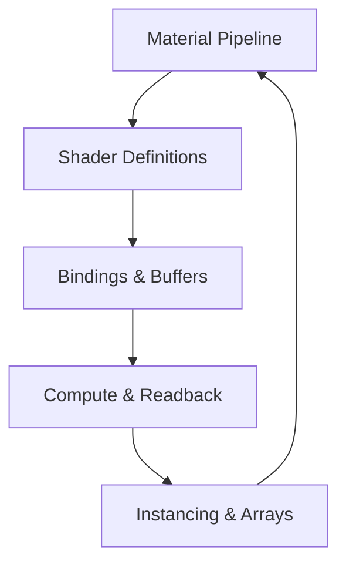

# Chapter 13 — Shader Fundamentals

When stock materials aren’t enough, custom shaders unlock new looks and workflows. This chapter follows Bevy’s shader tooling from material extensions through compute shaders and GPU readback, showing how pipelines exchange data between CPU and GPU. Every concept references the example that demonstrates it, so you can inspect the source as you read.



## Extending Built-in Materials

Bevy’s `StandardMaterial` becomes your launch pad. `examples/shader/extended_material.rs` extends the PBR shader with custom behaviour, letting you layer bespoke logic while reusing the engine’s lighting model. `examples/shader/extended_material_bindless.rs` pushes further by enabling bindless textures so one material can sample many assets without manual binding slots—a boon for large decal atlases or texture streaming.

Custom languages remain first-class citizens. `examples/shader/shader_material.rs` and `examples/shader/shader_material_2d.rs` build materials on top of WGSL, while `examples/shader/shader_material_glsl.rs` and `examples/shader/shader_material_wesl.rs` show how GLSL and WESL shaders still integrate cleanly. Shader definitions adjust behaviour at runtime: `examples/shader/shader_defs.rs` toggles shader chunks via `shader_defs`, tailoring features per entity.


### Game Context: Prism Arena Effects
Arena battler **Prism Arena** extends `StandardMaterial` using the pattern in `examples/shader/extended_material.rs` to add a glow mask, while bindless textures (`examples/shader/extended_material_bindless.rs`) feed dozens of insignias into a single draw call. The UI shares the same shader via `examples/shader/shader_material_2d.rs`, keeping brand colors consistent.

#### When to Avoid It
Bindless textures stay disabled on WebGL builds; they fall back to atlas sampling to remain compatible with older browsers.

## Managing Bindings and Arrays

Materials rely on textures and buffers. `examples/shader/array_texture.rs` demonstrates creating texture arrays for shaders expecting `texture_2d_array`, ideal for terrain layers or sprite sheets on the GPU. `examples/shader/storage_buffer.rs` introduces storage buffers via `AsBindGroup`, letting you stream structured data like skeletal transforms or particle state straight into shading code. When textures go missing, `examples/shader/fallback_image.rs` proves the fallback image handles all texture dimensions, keeping rendering predictable.

Automatic instancing emerges in `examples/shader/automatic_instancing.rs`, where cubes share a custom material and render in a single draw call; it even showcases `MeshTag` for piping external data into the material. Screen-space effects require special sampling: `examples/shader/shader_material_screenspace_texture.rs` samples view-independent UVs to overlay effects like film grain or vignette irrespective of mesh geometry.


### Game Context: Skyport Dashboard
Control room **Skyport Dashboard** stores telemetry in storage buffers (`examples/shader/storage_buffer.rs`) and displays it across a binding array (`examples/shader/texture_binding_array.rs`). Fallback textures (`examples/shader/fallback_image.rs`) guarantee graceful degradation when feeds drop out.

```rust
#[derive(AsBindGroup, TypeUuid)]
struct TelemetryMaterial {
    #[uniform(0)] frame: f32,
    #[storage(1)] grid: Vec4,
    #[texture(2, array)] charts: Handle<Texture>,
}
```

#### When to Avoid It
On constrained embedded hardware, Skyport collapses the binding array to a single atlas; random access across dozens of textures exceeds the memory budget.

## Compute Shaders and GPU Readback

Procedural logic moves onto the GPU through `examples/shader/compute_shader_game_of_life.rs`, which runs Conway’s Game of Life entirely in a compute shader. The main render loop simply displays the evolving grid, illustrating how compute tasks feed into render targets. When results need to come back to the CPU, `examples/shader/gpu_readback.rs` demonstrates `Readback` with storage buffers and textures, enabling tools like GPU-based simulation with CPU validation.

Animation-friendly data lives in uniforms like time. `examples/shader/animate_shader.rs` references global bindings so shaders can react to elapsed time without extra plumbing, perfect for pulsating surfaces or procedural distortion.


### Game Context: Particle Lab
VFX playground **Particle Lab** runs simulations through `examples/shader/compute_shader_game_of_life.rs`, then reads back metrics using `examples/shader/gpu_readback.rs` to plot graphs in-editor. Animated noise from `examples/shader/animate_shader.rs` keeps testbeds visually interesting while engineers tweak parameters.

#### When to Avoid It
Production builds avoid GPU readback inside tight loops; it’s reserved for tooling because stalling the GPU mid-frame can tank framerate.

## Prepasses and Multi-Stage Rendering

Complex pipelines sometimes need extra passes. `examples/shader/shader_prepass.rs` enables Bevy’s optional prepass on a per-material basis, letting you inject depth or normal information before the main draw. Combined with bindless textures and storage buffers, prepasses let you stage data just once and reuse it across multiple shading paths.


### Game Context: DepthForge
Cinematic renderer **DepthForge** enables material prepasses via `examples/shader/shader_prepass.rs` so screen-space effects like outline detection have accurate depth buffers before the main pass runs.

#### When to Avoid It
Prepasses double draw calls; DepthForge disables them on low-end laptops, falling back to simpler edge detection in post.

## Practice Prompts
- Extend `examples/shader/extended_material.rs` with a fallback path from `examples/shader/fallback_image.rs` so your custom shader gracefully handles missing textures.
- Drive a GPU particle simulation using `examples/shader/compute_shader_game_of_life.rs` as inspiration, streaming results back via `examples/shader/gpu_readback.rs` for analytics.
- Combine bindless textures from `examples/shader/shader_material_bindless.rs` with screen-space sampling in `examples/shader/shader_material_screenspace_texture.rs` to build a post-process overlay material that selects textures dynamically.

## Runbook
Explore the shader toolkit using these commands, then dive into the remaining examples as your effects grow:

```
cargo run --example extended_material
cargo run --example shader_defs
cargo run --example array_texture
cargo run --example compute_shader_game_of_life
cargo run --example gpu_readback
cargo run --example shader_prepass
```
