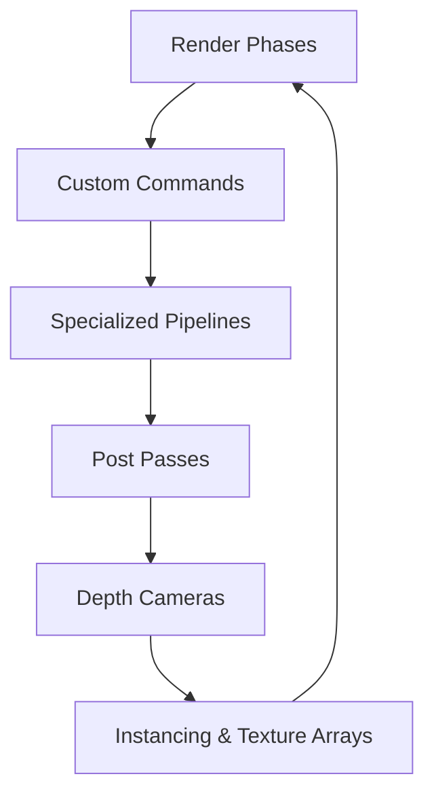
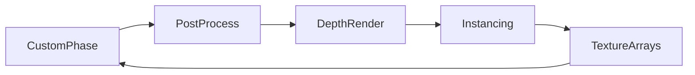

# Chapter 14 — Advanced Shader Techniques

Beyond material extensions lie full custom render phases, depth passes, and instancing tricks. This chapter explores how Bevy’s render graph can be bent to your will with custom commands, pass scheduling, and texture binding arrays. Each concept is grounded in the advanced shader examples that showcase these techniques.



## Custom Render Phases and Commands

At the heart of Bevy’s renderer are render phases. `examples/shader_advanced/custom_render_phase.rs` walks through creating an entirely new phase, illustrating how to control ordering and grouping of draw calls for bespoke effects. When you simply need to inject custom logic into an existing phase, `examples/shader_advanced/custom_phase_item.rs` shows how to enqueue a custom `RenderCommand` using `BinnedRenderPhase`, letting you execute arbitrary GPU work without rewriting the pipeline.

These building blocks empower techniques like stylised outlines, debug overlays, or hybrid forward/deferred passes tuned for your project.

```rust
pub struct OutlinePhase;

impl RenderPhase for OutlinePhase {
    type Item = Transparent3d;

    fn add_to_batch(batch: &mut Self::Batch, item: &Self::Item) {
        batch.add(item.clone());
    }
}
```

This scaffold, lifted from `examples/shader_advanced/custom_render_phase.rs`, shows how Echo Outline registers a bespoke phase before enqueueing the commands that draw silhouettes.


The advanced shader suite currently spotlights these few render graph demos—custom phases, post-processing, depth capture, and instancing—so plan to extend them when your project needs clustered lighting or bindless textures beyond what the examples cover today.

### Game Context: Echo Outline Renderer
Stylised shooter **Echo Outline** inserts a custom phase (`examples/shader_advanced/custom_render_phase.rs`) that draws silhouette strokes before the transparent pass. Engineers queue targeted commands using `examples/shader_advanced/custom_phase_item.rs`, giving artists per-character control.

#### When to Avoid It
The team avoids custom phases for small HUD tweaks; the added complexity isn’t worth it when a material override would suffice.

## Post-Processing and Depth Passes

Once you own phases, post-processing becomes a canvas. `examples/shader_advanced/custom_post_processing.rs` inserts a render pass after the main scene to apply chromatic aberration by sampling the main color target—a template for bloom variants, film grain, or LUT-driven grading. Depth data can drive downstream effects: `examples/shader_advanced/render_depth_to_texture.rs` renders a depth-only camera into a texture, enabling tricks like shadow mapping, depth-aware fog, or depth peeling for transparency.


### Game Context: Spectrum Editor
Internal tool **Spectrum** runs a post-process stage (`examples/shader_advanced/custom_post_processing.rs`) that samples the main color buffer to visualise color grading LUTs. Depth-only cameras from `examples/shader_advanced/render_depth_to_texture.rs` feed selection masks into the pass.

#### When to Avoid It
Depth-only cameras stay out of multiplayer replays; capturing per-frame depth for spectators would balloon bandwidth.

## Specialized Pipelines and Instancing

Sometimes materials aren’t flexible enough. `examples/shader_advanced/specialized_mesh_pipeline.rs` builds a fully specialized mesh pipeline, using `SpecializedMeshPipeline` with a custom `RenderCommand` to manage shaders, bind groups, and draw logic end-to-end. For geometry that needs custom vertex layouts, `examples/shader_advanced/custom_vertex_attribute.rs` demonstrates consuming additional vertex attributes—perfect for per-vertex metadata like curvature or animation weights.

Instancing remains crucial for performance. `examples/shader_advanced/custom_shader_instancing.rs` renders multiple instances of a mesh in a single draw call with a custom shader, showing how to pack instance data and mix it with Bevy’s auto-batching.


### Game Context: Astra Forge
Factory builder **Astra Forge** renders conveyor belts with a specialised mesh pipeline (`examples/shader_advanced/specialized_mesh_pipeline.rs`) and reads custom vertex attributes (`examples/shader_advanced/custom_vertex_attribute.rs`) for baked ambient occlusion. Instanced machines use `examples/shader_advanced/custom_shader_instancing.rs` to keep draw calls low.

#### When to Avoid It
Console builds simplify to standard materials when the specialised pipeline causes shader compilation spikes; stability wins over bespoke shading.

## Texture Arrays and Binding Tricks

Modern effects rely on arrays of textures. `examples/shader_advanced/texture_binding_array.rs` binds multiple textures via `binding_array<texture<f32>>`, sampling them non-uniformly; use it for texture atlases, decals, or layered terrain without dozens of uniforms. Combined with the specialized pipeline, you can stream texture sets dynamically per draw call.




### Game Context: Chronicle Atlas
Cartography suite **Chronicle Atlas** samples dozens of terrain textures from a binding array (`examples/shader_advanced/texture_binding_array.rs`), mixing them with the depth pass to generate relief shading.

#### When to Avoid It
On WebGL builds, the atlas reverts to a single texture because binding arrays exceed the available limits.

## Practice Prompts
- Create an outline pass by combining `examples/shader_advanced/custom_render_phase.rs` with a depth-only camera from `examples/shader_advanced/render_depth_to_texture.rs`.
- Build a GPU-accelerated decal system by pairing custom phase items (`examples/shader_advanced/custom_phase_item.rs`) with texture binding arrays (`examples/shader_advanced/texture_binding_array.rs`).
- Extend `examples/shader_advanced/custom_shader_instancing.rs` so instances sample different textures via the binding array example, reducing draw calls for varied props.

## Runbook
Explore the advanced shader toolkit by running these examples, then adapt them to your rendering experiments:

```
cargo run --example custom_render_phase
cargo run --example custom_post_processing
cargo run --example render_depth_to_texture
cargo run --example specialized_mesh_pipeline
cargo run --example custom_shader_instancing
cargo run --example texture_binding_array
```
