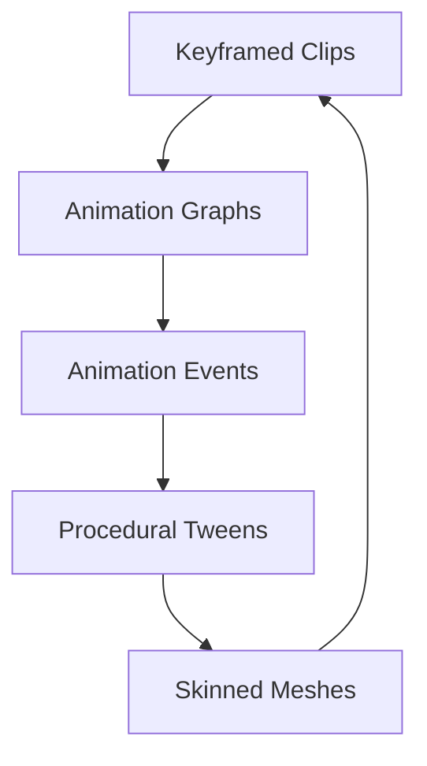
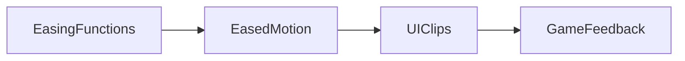
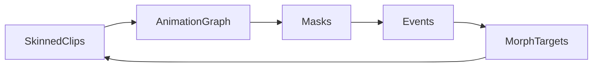

# Chapter 15 — Animation Systems

Bevy’s animation stack ranges from UI clip playback to fully skinned rigs and procedural tweens. This chapter weaves those layers together so you can choreograph motion across characters, interfaces, and gameplay feedback. Each storyline references the examples that make the techniques concrete.



## Character and Skeletal Animation

### Deep Dive: Clip Playback
`examples/animation/animated_mesh_control.rs` demonstrates how to swap clips mid-run, while `examples/animation/gltf_skinned_mesh.rs` and `examples/animation/custom_skinned_mesh.rs` show both imported and code-authored rigs using the same APIs. Morph-driven expressions from `examples/animation/morph_targets.rs` layer on top of base locomotion clips, and `examples/animation/animated_mesh_events.rs` surfaces events for VFX hooks.

#### When to Avoid It
Reserve full skeletal blending for heroes and bosses—background crowds in Ironstride Heroes fall back to tweened billboards to save CPU.


Clip-driven animation is the backbone of sequencing. `examples/animation/animated_ui.rs` shows how the same clip system that drives characters can animate UI properties—scaling, color, and layout timing. It highlights how animation nodes sit alongside ECS components so menus, HUDs, and in-world billboards can all reference the same animation assets used for characters, keeping timing consistent across the entire experience.


### Game Context: Ironstride Heroes
Action RPG **Ironstride Heroes** layers dialogue gestures on top of combat animations using the clip playback loop from `examples/animation/animated_mesh.rs`. The team leverages animation events (`examples/animation/animation_events.rs`) to trigger sword clangs and camera shakes exactly when keyframes hit.

```rust
fn trigger_sfx(mut reader: EventReader<AnimationEvent>, audio: Res<Audio>, sfx: Res<HeroSounds>) {
    for event in reader.read() {
        if event.event_id() == "swing" {
            audio.play(sfx.sword.clone());
        }
    }
}
```

#### When to Avoid It
For ambient crowd motion, Ironstride opts for lightweight tweening rather than skeletal graphs; complex rig blending would waste CPU on background NPCs.

## Sprite and 2D Animation

Sprite flipbooks and atlas-driven loops were covered earlier in Chapter 7; revisit those examples (`examples/2d/sprite_sheet.rs`, `examples/2d/sprite_animation.rs`) when you need frame-based characters. They slot neatly beside the systems in this chapter: tweened easing can trigger sprite swaps, and animation events can fire particles or UI prompts while sprites change frames.


### Game Context: Pocket Patrol
Mobile tactics game **Pocket Patrol** uses sprite sheets to drive character facings, while UI animations reuse the same clip system (`examples/animation/animated_ui.rs`) for reward pop-ups.

```rust
fn spawn_sprite(commands: &mut Commands, atlas: Handle<TextureAtlas>) {
    commands.spawn(SpriteSheetBundle {
        texture_atlas: atlas,
        sprite: TextureAtlasSprite::new(IdleFacing::South as usize),
        transform: Transform::from_xyz(0.0, 0.0, 1.0),
        ..default()
    });
}
```

The snippet mirrors `examples/2d/sprite_sheet.rs`, showing how Pocket Patrol swaps atlas indices in code while tween events trigger frame changes during ability windups.

#### When to Avoid It
Pocket Patrol keeps sprite animations short; anything longer than a second transitions to skeletal rigs to avoid ballooning atlas memory.

## Tweening and Procedural Motion

### Deep Dive: Procedural Layers
`examples/animation/animated_transform.rs` lets Echo Nodes pulse puzzle tiles without touching animation clips, and `examples/animation/color_animation.rs` animates UI gradients in tandem. Developers feed easing curves from the earlier sample directly into these helpers for consistent timing.

#### When to Avoid It
Procedural tweens shine for short transitions; longer multi-minute sequences are easier to author in clips where artists can preview timing visually.


When keyframes are overkill, tweens step in. `examples/animation/easing_functions.rs` catalogs the easing curves bundled with Bevy, previewing how each shaping function looks in motion. `examples/animation/eased_motion.rs` then applies those curves to a moving entity, blending start and end transforms in real time. Together they provide the vocabulary for procedural motion: buttons that spring back, pickups that hover, cameras that glide into position without bespoke animation clips.

```rust
fn pulse_tile(mut tiles: Query<(&TweenHandle, &mut Transform)>, time: Res<Time>) {
    for (_handle, mut transform) in &mut tiles {
        let phase = (time.elapsed_seconds() * 2.0).sin();
        transform.scale = Vec3::splat(1.0 + 0.05 * phase);
    }
}
```

This follows `examples/animation/eased_motion.rs`, applying an easing-driven sine pulse to echo how procedural tweens keep motion lightweight.




### Game Context: Echo Nodes
Puzzle title **Echo Nodes** relies on easing curves from `examples/animation/easing_functions.rs` to animate puzzle tiles snapping into place. The tween system (`examples/animation/eased_motion.rs`) keeps transitions consistent even when designers shuffle timings late in production.

#### When to Avoid It
The team avoids chaining dozens of tweens for long sequences—instead they bake keyframes where precise timing is needed to keep code and content maintainable.

## Specialized Animation Techniques

Production characters need more than simple loops. Start with rig playback: `examples/animation/animated_mesh.rs`, `examples/animation/animated_mesh_control.rs`, and `examples/animation/animated_mesh_events.rs` animate skinned glTF models, layer controls on top, and emit events as clips reach key frames. When you want code-defined animation, `examples/animation/animated_transform.rs` generates curves directly against the `Transform` component.

Complex scenes benefit from graphs and masks. `examples/animation/animation_graph.rs` renders the animation graph while demonstrating blend nodes, state transitions, and parameter control. `examples/animation/animation_masks.rs` restricts clips to subsets of the skeleton—upper-body emotes layered over lower-body locomotion, for example.

Events glue systems together. `examples/animation/animation_events.rs` triggers custom logic when clips hit markers, perfect for synchronising sound effects or gameplay cues. `examples/animation/color_animation.rs` animates colors across different color spaces, showing how splines can add flourish to UI or magical effects.

Custom rigs matter too. `examples/animation/custom_skinned_mesh.rs` builds a skinned mesh entirely from code, matching the structure of `examples/animation/gltf_skinned_mesh.rs`, which loads the same rig from glTF. Morph targets add facial expressions or shape-shifting: `examples/animation/morph_targets.rs` plays a morph animation and exposes how to read morph target names for debugging or personalisation.




### Game Context: Chimera Workshop
Creature builder **Chimera Workshop** lets players stitch together custom rigs using `examples/animation/custom_skinned_mesh.rs`, then layer morph targets (`examples/animation/morph_targets.rs`) for expressions. Animation graphs (`examples/animation/animation_graph.rs`) blend locomotion with emotes, while masks (`examples/animation/animation_masks.rs`) isolate upper bodies during crafting minigames.

#### When to Avoid It
The workshop exports finished creatures with baked clips; runtime morph editing stays inside creation mode to avoid network sync issues in multiplayer arenas.

## Practice Prompts
- Drive a HUD transition by combining `examples/animation/animated_ui.rs` with easing profiles from `examples/animation/eased_motion.rs` so menu panels feel responsive.
- Blend a locomotion set with emotes using `examples/animation/animation_graph.rs` and `examples/animation/animation_masks.rs`, firing hit reactions via `examples/animation/animation_events.rs`.
- Prototype a shapeshifting character by extending `examples/animation/morph_targets.rs`, then swap in a code-defined rig from `examples/animation/custom_skinned_mesh.rs` to test custom meshes.

## Runbook
Try these examples to get comfortable before mixing techniques in your project:

```
cargo run --example animated_ui
cargo run --example easing_functions
cargo run --example animated_mesh
cargo run --example animation_graph
cargo run --example animation_masks
cargo run --example morph_targets
```
