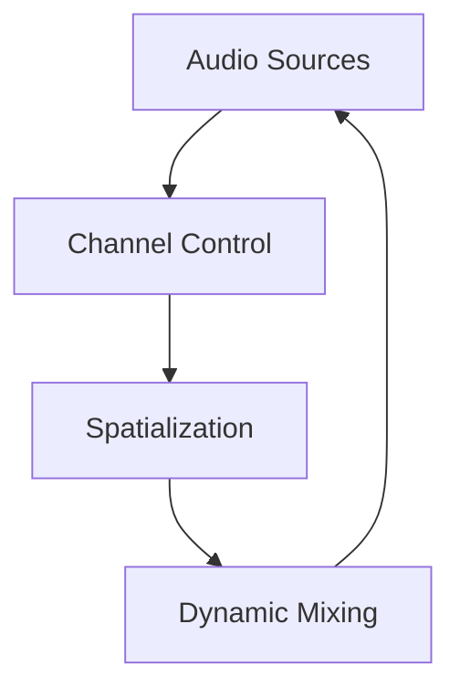

# Chapter 16 — Soundscapes and Audio Systems

Audio breathes emotion into worlds. This chapter explores how Bevy handles playback, dynamic control, positional audio, and custom decoders so you can score scenes with precision. Each concept links to the example that implements it, letting you listen along as you build.



## Audio Playback Foundations

Start with simple cues. `examples/audio/audio.rs` loads and plays a clip, revealing how Bevy streams audio assets and handles format feature flags. Once playback works, `examples/audio/audio_control.rs` shows how to pause, resume, stop, and loop audio via handles—essential for menu music, cutscene voice-overs, or dynamic ambience.

Dedicated aesthetics rely on specialized sources. `examples/audio/pitch.rs` synthesizes a single-frequency tone, useful for UI cues or debugging oscillators. For games that swap music based on state, `examples/audio/soundtrack.rs` orchestrates multiple tracks, crossfading as gameplay transitions from exploration to combat.


### Game Context: Skylane Control Tower
Live ops sim **Skylane Control** layers ambient tracks via `examples/audio/soundtrack.rs`, while radio chatter cues play through `examples/audio/audio_control.rs` so controllers can pause and resume transmissions.

#### When to Avoid It
The tower avoids looping voice-overs; once a call is acknowledged, the clip stops to prevent auditory clutter.

## Spatial and Reactive Audio

Sound becomes believable when it anchors to space. `examples/audio/spatial_audio_2d.rs` positions audio emitters in a 2D plane so scrolling arcades or puzzle games can pan effects left and right. `examples/audio/spatial_audio_3d.rs` extends the same approach into 3D, tracking listener orientation and distance to create immersion in first-person adventures or VR experiences.

```rust
fn attach_spatial_sound(
    mut commands: Commands,
    asset_server: Res<AssetServer>,
    mut spatial_audio: ResMut<SpatialAudio>
) {
    let handle = asset_server.load("audio/whale.ogg");
    commands.spawn((
        Transform::from_xyz(0.0, 0.0, -15.0),
        GlobalTransform::default(),
        spatial_audio.play(handle)
            .with_radius(30.0)
            .with_falloff(Falloff::InverseSquare)
    ));
}
```

This utility mirrors the setup in `examples/audio/spatial_audio_3d.rs`, pairing Bevy’s spatial emitter with a transform so DeepDive VR can reposition whales as the submarine drifts.

These samples emphasise the synergy between transforms and audio channels: as entities move, their audio follows, and when listeners rotate, the mix responds instantly.


### Game Context: DeepDive VR
Immersive explorer **DeepDive VR** positions ocean ambience with `examples/audio/spatial_audio_3d.rs` so whales echo realistically around the submarine. For top-down companion apps the team reuses the 2D variant (`examples/audio/spatial_audio_2d.rs`).

#### When to Avoid It
On mobile fallback builds the team disables spatialisation to conserve CPU and battery, mixing stereo tracks instead.

## Specialized Audio Techniques

### Deep Dive: Procedural Sources
`examples/audio/decodable.rs` builds a sine-wave generator by implementing `Decodable`. PulseForge wraps that pattern in a library of oscillators, allowing designers to audition alert tones without leaving the game.

```rust
fn trigger_alarm(audio: Res<Audio>, synth: Res<SynthCatalog>) {
    let tone = synth.sine(440.0).with_decay(0.4);
    audio.play(tone);
}
```

#### When to Avoid It
Procedural synthesis can be CPU hungry—PulseForge falls back to pre-rendered samples on low-end devices to preserve performance.


Custom decoders expand Bevy beyond shipped formats. `examples/audio/decodable.rs` implements a simple sine-wave `Decodable`, illustrating how you can feed procedural audio or third-party codecs into the engine. It’s the foundation for adaptive soundscapes where synthesis or network streams replace static files.


Bevy’s specialized audio coverage currently centers on the decodable example—treat it as a starting point for custom codecs until more advanced synthesis samples land.

### Game Context: PulseForge Synth Lab
Music sandbox **PulseForge** generates procedural tones through the custom decodable pipeline in `examples/audio/decodable.rs`, letting players sculpt sine waves and layer them with preset tracks.

#### When to Avoid It
Procedural decoding stays out of latency-sensitive rhythm stages; those rely on pre-rendered stems to guarantee timing accuracy.

## Practice Prompts
- Blend `examples/audio/soundtrack.rs` with `examples/audio/audio_control.rs` so a single manager fades between music layers while pausing when the game moves into menus.
- Attach the transforms from `examples/audio/spatial_audio_3d.rs` to the camera rig you built in Chapter 4 so footstep and ambient sounds react to head movement.
- Use `examples/audio/decodable.rs` to inject synthesized alert tones that pitch-shift based on gameplay variables, complementing UI signals.

## Runbook
Spin up these examples to hear the toolkit, then adapt them to your project’s audio design:

```
cargo run --example audio
cargo run --example audio_control
cargo run --example soundtrack
cargo run --example spatial_audio_3d
cargo run --example decodable
```
