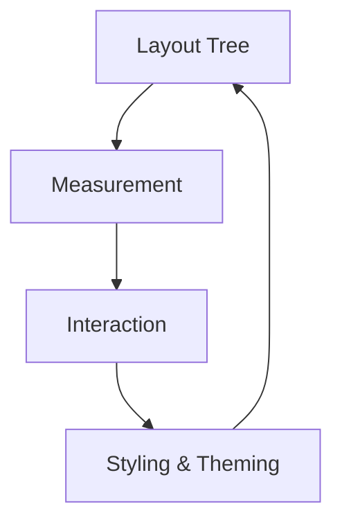
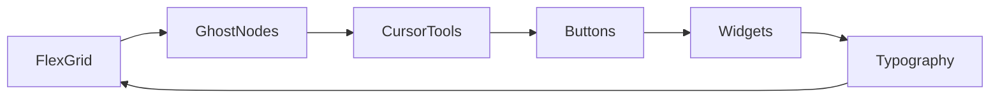

# Chapter 17 — UI Layout and Styling

Interface design in Bevy means composing layouts, measuring text, and styling widgets so they respond to focus and motion. This chapter connects layout primitives, cursor utilities, and styling patterns into a narrative that mirrors real production UI flows. Each paragraph references the example where you can inspect the implementation.



## Layouts, Grids, and Positioning

We start with the flexbox-inspired spine. `examples/ui/flex_layout.rs` shows how `AlignItems` and `JustifyContent` cooperate to arrange text, while `examples/ui/grid.rs` brings CSS Grid-like positioning to multi-column dashboards. Debugging layout is essential: `examples/ui/viewport_debug.rs` toggles between viewport and pixel coordinates to verify that nodes align, and `examples/ui/text_debug.rs` proves how text wrapping, alignment, and font metrics influence frame flow.

Ghost nodes act as invisible structure. `examples/ui/ghost_nodes.rs` demonstrates ghost nodes that disappear from layout while preserving their children—ideal for toggling optional panels without rewriting the hierarchy. Cursor-aware interfaces depend on `examples/ui/relative_cursor_position.rs`, which reports the pointer location relative to a node, powering hover effects, sliders, or radial menus.

Together, these tools let you treat UI as a data-driven tree: layout becomes declarative, measurement remains predictable, and interaction coordinates stay meaningful.


### Game Context: Atlas Ops Dashboard
Strategy hub **Atlas Ops** arranges mission widgets using the grid utilities from `examples/ui/grid.rs`, while ghost nodes (`examples/ui/ghost_nodes.rs`) hide classified panels. Cursor-relative metrics from `examples/ui/relative_cursor_position.rs` drive tooltip placement over satellite imagery.

#### When to Avoid It
Atlas Ops avoids deeply nested ghost nodes—too many invisible parents make debugging layout order painful.

## Styling, Theming, and Typography

Look and feel anchor the brand. `examples/ui/text.rs` sets up dynamic text (including an FPS counter) so content can change every frame. Background treatments appear in `examples/ui/text_background_colors.rs`, adding color behind glyphs for emphasis, while `examples/ui/transparency_ui.rs` explains how text transparency interacts with button backgrounds.

Buttons remain a staple. `examples/ui/button.rs` updates color and label based on interaction state, providing a template for hover, press, and focus feedback. More advanced controls surface in `examples/ui/standard_widgets.rs`, which uses `bevy_ui_widgets` to compose sliders, toggles, and other widgets while adding custom styles so they blend with your theme. Typography internals become clear in `examples/ui/font_atlas_debug.rs`, exposing how font atlases populate so you can reason about caching and glyph fallback.

Overflow and depth keep the hierarchy tidy. `examples/ui/overflow_clip_margin.rs` shows how to clip child content with custom margins, and `examples/ui/z_index.rs` demonstrates layering with z-order so tooltips float above cards without disturbing layout order.




### Game Context: Prism Ledger
Finance sim **Prism Ledger** themes buttons with `examples/ui/button.rs`, overlays gradient headers from `examples/ui/stacked_gradients.rs`, and monitors glyph usage via `examples/ui/font_atlas_debug.rs` to ensure international characters render crisply.

```rust
fn update_balance_text(mut query: Query<&mut Text, With<BalanceLabel>>, ledger: Res<LedgerState>) {
    for mut text in &mut query {
        text.sections[0].value = format!("$ {:.02}", ledger.current_balance());
    }
}
```

#### When to Avoid It
Highly stylised transparency layers stay out of performance-critical HUDs; Prism Ledger uses solid colors during data entry to maximise readability.

## Practice Prompts
- Build a dashboard by combining `examples/ui/grid.rs` for layout with widget styling techniques from `examples/ui/standard_widgets.rs`, highlighting active panels using `examples/ui/z_index.rs`.
- Use `examples/ui/relative_cursor_position.rs` to drive a custom tooltip system, then ensure clipping via `examples/ui/overflow_clip_margin.rs` when tooltips sit inside scrollable containers.
- Experiment with font fallbacks by pairing `examples/ui/text.rs` and `examples/ui/font_atlas_debug.rs`, confirming that international characters populate the atlas without misalignment.

## Runbook
Launch these samples to get comfortable with the UI toolkit, then merge ideas into your own interface:

```
cargo run --example flex_layout
cargo run --example grid
cargo run --example button
cargo run --example text
cargo run --example standard_widgets
```
