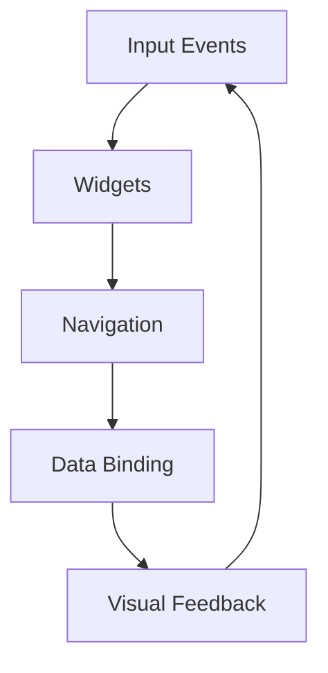
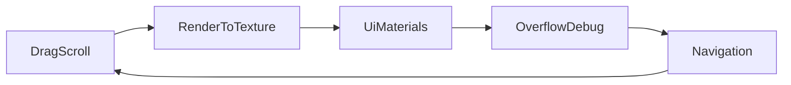

# Chapter 18 — Interactive Widgets and HUDs

Interfaces need to react, route events, and reflect game state. This chapter builds on the layout and styling foundations to wire interactivity, navigation, scroll behaviour, and rendering tricks that empower complex HUDs. Every concept points to the example that proves it works.



## Interaction and Navigation

Buttons and panels can do more than change color—they can preserve pixel-perfect art. `examples/ui/ui_texture_slice.rs` and `examples/ui/ui_texture_atlas_slice.rs` 9-slice their textures so buttons stretch without distortion, an invaluable trick when branding needs crisp corners. `examples/ui/window_fallthrough.rs` demonstrates mouse passthrough: toggling the window into a transparent overlay that forwards input to the window beneath, ideal for overlays or debug HUDs.

Navigation is more than clicks. `examples/ui/directional_navigation.rs` configures arrow-key or gamepad traversal between widgets, while `examples/ui/tab_navigation.rs` gives keyboard users a Tab-order experience that mirrors desktop apps. Drag-driven widgets appear in `examples/ui/drag_to_scroll.rs`, which ties dragging gestures to scroll behaviour, and `examples/ui/ui_drag_and_drop.rs`, where nodes can be dragged and reparented, making inventory grids and radial menus possible.

```rust
fn setup_navigation(mut commands: Commands) {
    commands.spawn(InteractionRoot::default()).with_children(|parent| {
        parent.spawn((ButtonBundle::default(), FocusPolicy::Block))
            .insert(Navigation::scope().with_direction_targets(DirectionTargets::all()));
    });
}
```

Just like `examples/ui/directional_navigation.rs`, this scaffold seeds a navigation scope so controllers and keyboards can traverse widgets predictably.


These navigation samples cover Bevy’s current first-party offering—directional and tab traversal plus drag-to-scroll—so plan to wire external libraries if you need full spatial graph routing beyond these references.

### Game Context: Starport Control Room
Multiplayer commander **Starport Control** keeps consoles accessible via directional navigation (`examples/ui/directional_navigation.rs`, `examples/ui/tab_navigation.rs`) while 9-sliced buttons (`examples/ui/ui_texture_slice.rs`) maintain crisp sci-fi bezels. Drag-to-scroll (`examples/ui/drag_to_scroll.rs`) powers log viewers so officers can sift through event feeds quickly.

#### When to Avoid It
Touch-first interfaces strip back keyboard-based navigation to avoid confusing mobile users with focus indicators meant for controllers.

## Data-Driven UI and HUD Overlays

HUDs pull double duty as data displays. For scroll-heavy dashboards, `examples/ui/scroll.rs` and `examples/ui/scrollbars.rs` manage content overflow, while size constraints from `examples/ui/size_constraints.rs` keep cards and panels tidy. When UI elements need to render inside 3D scenes, `examples/ui/render_ui_to_texture.rs` captures a UI subtree and displays it on a mesh—perfect for diegetic monitors.

The `UiScale` resource, shown in `examples/ui/ui_scaling.rs`, adapts interfaces to different device pixel ratios, and `examples/ui/viewport_node.rs` embeds a live viewport widget so players or developers can interact with a secondary camera feed. These tools ensure HUDs and overlays stay in sync with gameplay state while remaining accessible across form factors.


### Game Context: Frontier Explorer HUD
Exploration game **Frontier Explorer** renders a diegetic tablet using `examples/ui/render_ui_to_texture.rs`, projecting mission briefs onto cockpit screens. Scrollbars (`examples/ui/scrollbars.rs`) and size constraints (`examples/ui/size_constraints.rs`) keep data legible.

#### When to Avoid It
Rendering UI to textures is skipped on resource-constrained builds; the team flips to flat HUD layers when GPU memory is limited.

## Specialized UI Techniques

Advanced widgets benefit from styling experiments. `examples/ui/borders.rs`, `examples/ui/box_shadow.rs`, and `examples/ui/gradients.rs` layer borders, shadows, and gradients for richer visuals. Stack them with `examples/ui/stacked_gradients.rs` to create complex backgrounds.

Feathers widgets (`examples/ui/feathers.rs`) and `examples/ui/standard_widgets_observers.rs` showcase experimental control APIs, while `examples/ui/ui_material.rs` shows how to modify custom `UiMaterial` values for animated or shader-driven UI. Transparency and depth remain crucial: `examples/ui/display_and_visibility.rs` explains how `Display` and `Visibility` differ, `examples/ui/overflow.rs` and `examples/ui/overflow_debug.rs` cover clipping behaviour, and `examples/ui/ui_target_camera.rs` manages camera ordering when multiple UI layers share the screen.

Textures remain foundational. `examples/ui/ui_texture_atlas.rs` demonstrates using texture atlases for icon sets, and `examples/ui/ui_texture_slice_flip_and_tile.rs` teaches flipping and tiling 9-sliced images without distortion. Motion can be scripted via transforms in `examples/ui/ui_transform.rs`, while `examples/ui/text_wrap_debug.rs` investigates how wrapping behaves when content breaks across lines. Input-rich scenes even integrate `examples/ui/virtual_keyboard.rs`, offering an on-screen keyboard for touch devices or kiosk setups.




### Game Context: Neon News Feed
Streamer overlay **Neon News** blends box shadows (`examples/ui/box_shadow.rs`), gradients (`examples/ui/gradients.rs`), and Feathers widgets (`examples/ui/feathers.rs`) into flashy tickers. Custom materials (`examples/ui/ui_material.rs`) pulse headlines based on subscriber counts.

```rust
fn update_gradient(mut materials: ResMut<Assets<UiGradientMaterial>>, stats: Res<ChannelStats>) {
    for mat in materials.iter_mut() {
        mat.0.colors[0].a = 0.5 + stats.hype_level * 0.5;
    }
}
```

#### When to Avoid It
Live broadcasts keep overflow clipping simple; stacking multiple gradient nodes can create aliasing on compressed video streams.

## Practice Prompts
- Combine `examples/ui/ui_texture_atlas_slice.rs` with `examples/ui/tab_navigation.rs` to build a console-friendly menu that keeps pixel-perfect buttons while supporting keyboard traversal.
- Create a diegetic terminal by rendering a UI subtree (`examples/ui/render_ui_to_texture.rs`) onto a 3D mesh, then layer interactive scroll regions from `examples/ui/scrollbars.rs`.
- Prototype a touch-first inventory using `examples/ui/ui_drag_and_drop.rs`, scaled with `examples/ui/ui_scaling.rs`, and overlay custom gradients inspired by `examples/ui/stacked_gradients.rs`.

## Runbook
Explore interactivity with this starting lineup, then expand into the remaining samples:

```
cargo run --example ui_texture_slice
cargo run --example directional_navigation
cargo run --example scrollbars
cargo run --example render_ui_to_texture
cargo run --example ui_drag_and_drop
```
