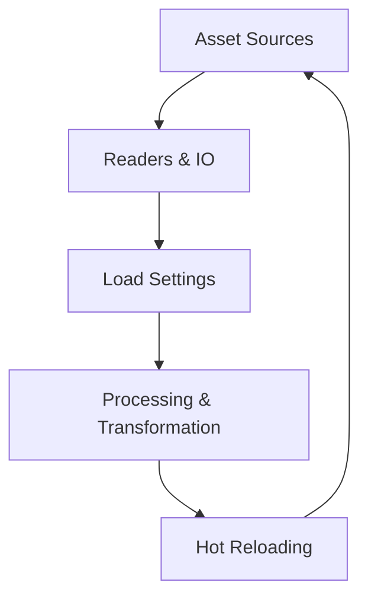
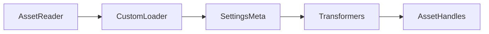

# Chapter 19 — Asset Loading Patterns

Content iteration lives or dies on how quickly you can ingest data. This chapter traces Bevy’s asset server workflows—from local disk and embedded bytes to remote HTTP and custom processors—so your pipeline stays responsive as teams iterate. Each concept references the example where you can inspect the implementation.



## Discovering and Reading Assets

We begin with the basics. `examples/asset/asset_loading.rs` enumerates the common ways to load assets—eager, deferred, and via handles—while `examples/asset/multi_asset_sync.rs` demonstrates waiting for several handles at once before advancing state. Embedded data joins the mix with `examples/asset/embedded_asset.rs`, showing how to bake assets into the binary when disk access is unavailable.

Asset IO becomes extensible through custom readers. `examples/asset/custom_asset_reader.rs` plugs in a bespoke `AssetReader`, letting the server fetch bytes from encrypted bundles, archives, or proprietary locations.

```rust
fn register_https_source(app: &mut App) {
    app.world.resource_mut::<AssetServer>()
        .register_asset_source("seasonal", AssetSource::build().with_reader(WebAssetReader::https()));
}
```

This helper draws directly from `examples/asset/web_asset.rs`, showing how Night Bazaar mounts a remote source alongside the filesystem. From there, `examples/asset/extra_source.rs` registers additional asset sources alongside the default filesystem so you can mount DLC packages or user mods without touching core code. Remote projects tap `examples/asset/web_asset.rs`, which fetches assets over HTTPS (with optional caching) for live-service deployments or web clients.

Compression and repetition also matter. `examples/asset/asset_decompression.rs` teaches how to ingest gzip-compressed assets transparently. When textures need to tile beyond their default clamp, `examples/asset/repeated_texture.rs` configures the sampler at load time, ensuring artists don’t repeat the same boilerplate across systems.


### Game Context: Night Bazaar Mod Loader
Mod-friendly RPG **Night Bazaar** registers an extra asset source (`examples/asset/extra_source.rs`) for user-created content while keeping embedded assets (`examples/asset/embedded_asset.rs`) for core art. Web-featured events pull cosmetics from HTTPS (`examples/asset/web_asset.rs`) during seasonal updates.

#### When to Avoid It
The live game avoids remote fetches on startup—network hiccups would delay players—so remote sources only activate for optional downloads.

## Controlling Load Settings and Processing

Once bytes arrive, settings dictate behaviour. `examples/asset/asset_settings.rs` uses `.meta` files and `AssetServer::load_with_settings` to override defaults per asset, from texture sampling to HDR flags. `examples/asset/custom_asset.rs` dives deeper by defining a brand-new asset type plus loader, mapping custom formats (think dialogue trees or gameplay curves) directly into ECS resources.

```rust
#[derive(Asset, TypePath)]
pub struct DialogueTree;

impl AssetLoader for DialogueLoader {
    type Asset = DialogueTree;
    type Error = DialogueError;

    fn load<'a>(
        &'a self,
        reader: &'a mut Reader,
        _settings: &'a LoadContext
    ) -> BoxedFuture<'a, Result<Self::Asset, Self::Error>> {
        Box::pin(async move { Ok(parse_dialogue(reader).await?) })
    }
}
```

This loader is adapted from `examples/asset/custom_asset.rs`, illustrating how ForgeFrame maps bespoke data into engine assets before processors take over.

Processing pipelines provide guardrails. `examples/asset/processing/asset_processing.rs` wires custom `AssetLoader`s, `AssetTransformer`s, and `AssetSaver`s together so you can preprocess data—generating lightmaps, validating schemas, or compressing blobs—before gameplay touches them. Each processor becomes a reusable unit in your toolchain.

```rust
fn register_processors(app: &mut App) {
    app.insert_resource(AssetProcessingPipeline::new()
        .with_loader(LevelLoader)
        .with_transformer(NormalMapBaker)
        .with_saver(LevelSaver));
}
```

The sketch mirrors `examples/asset/processing/asset_processing.rs`, wiring loader, transformer, and saver stages into a single pipeline.




### Game Context: ForgeFrame Studio
In-house editor **ForgeFrame** tweaks per-texture settings via `.meta` files (`examples/asset/asset_settings.rs`) and runs a processing pipeline (`examples/asset/processing/asset_processing.rs`) to bake normal maps before handing assets to level designers.

#### When to Avoid It
The runtime build strips processing plugins; players download assets already processed to reduce startup latency.

## Keeping Iteration Instant

Fast feedback keeps teams shipping. `examples/asset/hot_asset_reloading.rs` enables hot reload, watching the filesystem so you can tweak art or configuration and see changes live. For projects straddling multiple sources, the hot reload example combines nicely with the extra source and web loader patterns: a single tweak on disk or remote storage propagates straight into the running world.


### Game Context: Skyline Live Edit
Architecture visualizer **Skyline** relies on hot reloading (`examples/asset/hot_asset_reloading.rs`) so artists can swap facade textures mid-session. When multiple assets must land together, the dashboard waits for every handle using `examples/asset/multi_asset_sync.rs` before swapping roof, walls, and props simultaneously.

#### When to Avoid It
Hot reload stays disabled in multiplayer review sessions to prevent designers from accidentally pushing half-finished asset changes to teammates.

## Practice Prompts
- Extend `examples/asset/custom_asset.rs` so your proprietary data format is read via the custom IO from `examples/asset/custom_asset_reader.rs`, then run it through a transformer defined in `examples/asset/processing/asset_processing.rs`.
- Configure a hybrid pipeline where the base game uses embedded assets (`examples/asset/embedded_asset.rs`) but mod content loads from an additional source (`examples/asset/extra_source.rs`) with hot reload enabled.
- Set texture sampling preferences by combining per-asset settings (`examples/asset/asset_settings.rs`) with the tiling behaviour from `examples/asset/repeated_texture.rs` for a stylised environment pack.

## Runbook
Start with these commands to hear the pipeline in action, then dive into the remaining samples as your asset workflow evolves:

```
cargo run --example asset_loading
cargo run --example multi_asset_sync
cargo run --example custom_asset
cargo run --example asset_processing
cargo run --example hot_asset_reloading
```
