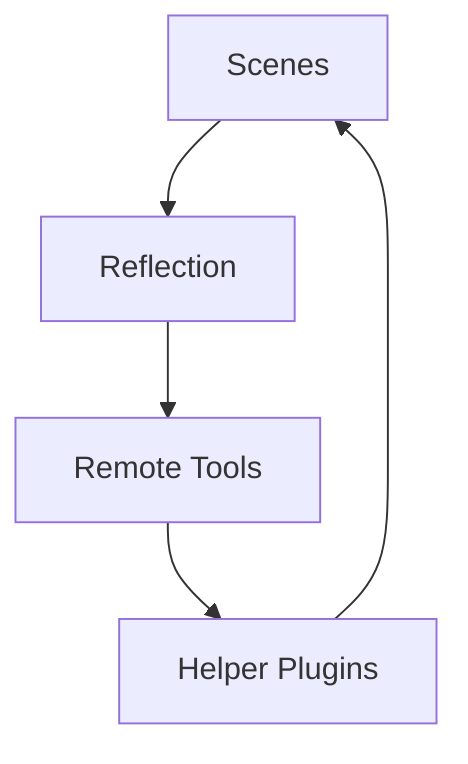
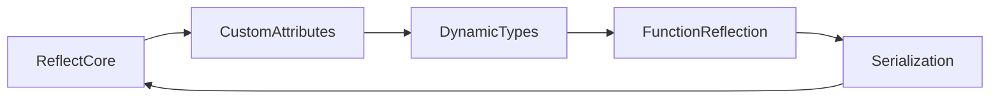

# Chapter 20 — Scenes, Reflection, and Remote Tooling

Shipping games means gluing content pipelines to runtime systems. This chapter shows how Bevy scenes load into the world, how reflection lets you inspect and edit data dynamically, and how remote tooling plus helper plugins keep iteration tight. Each idea references the example that demonstrates it in practice.



## Scene Graphs and Prefabs

### Deep Dive: Incremental Updates
`examples/scene/scene.rs` doesn’t just spawn prefabs; it can patch existing entities headlessly. Beacon leverages that to stream room-by-room edits—when an artist nudges a lamp in Blender, the scene loader issues component updates without respawning the entire room.

#### When to Avoid It
For procedurally generated dungeons, streaming scenes can be overkill; building entities directly keeps memory usage predictable.


Prefabs let artists and designers assemble content outside the codebase. `examples/scene/scene.rs` loads scene data from files, spawning entities and updating existing ones on demand.

```rust
fn load_scene(server: Res<AssetServer>, mut commands: Commands) {
    let scene_handle = server.load("levels/room.glb#Scene0");
    commands.spawn(SceneBundle { scene: scene_handle, ..default() });
}
```

Exactly like `examples/scene/scene.rs`, Beacon spawns a `SceneBundle` handle so subsequent hot reloads patch entities in place. The example illustrates how scenes bundle meshes, materials, and components; once loaded, your systems treat them like native entities. Combine this workflow with asset hot reloading (Chapter 19) to tweak scenes and see changes live.


### Game Context: Beacon Editor
Level designer tool **Beacon** imports prefab scenes via `examples/scene/scene.rs`, letting artists lay out props in Blender and drop them straight into the editor.

#### When to Avoid It
Procedural dungeons skip prefab spawning; they generate layouts in code to keep memory use predictable across runs.

## Reflection and Introspection

Runtime editing hinges on reflection. `examples/reflection/reflection.rs` introduces the core API for accessing struct fields by name, while `examples/reflection/reflection_types.rs` explores fundamental types (structs, tuples, vectors).

```rust
fn tweak_component(world: &mut World, entity: Entity) {
    if let Some(mut reflect) = world.entity_mut(entity).reflect_mut() {
        if let Some(health) = reflect.field_mut("health") {
            health.apply(&100_f32.into());
        }
    }
}
```

Pulled from `examples/reflection/reflection.rs`, this helper shows how Scribe pokes arbitrary components via reflection without compile-time types. Generic types aren’t left behind—`examples/reflection/generic_reflection.rs` shows how derives handle type parameters gracefully.

Custom metadata unlocks richer editor experiences. `examples/reflection/custom_attributes.rs` registers and queries custom attributes so in-house editors can read hints, tooltips, or validation annotations. For dynamic type creation, `examples/reflection/dynamic_types.rs` constructs types at runtime, enabling plugin-based data definitions.

Function and serialization reflection keep tools DRY. `examples/reflection/function_reflection.rs` calls regular Rust functions dynamically, while `examples/reflection/serialization.rs` serialises and deserialises reflected types—perfect for save systems or copy/paste buffers. Finally, `examples/reflection/type_data.rs` walks through type data registration, and the helper duo `examples/reflection/auto_register_static/src/lib.rs` with `examples/reflection/auto_register_static/src/bin/main.rs` explain how to auto-register reflective types on platforms without `inventory` support (like WebAssembly or iOS).




### Game Context: Scribe Console
Debug console **Scribe** uses reflection (`examples/reflection/reflection.rs`, `examples/reflection/function_reflection.rs`) to inspect and tweak runtime components on live builds. Custom attributes annotate fields so QA knows which sliders are safe to touch.

#### When to Avoid It
Gameplay code avoids reflection in hot loops; accessing fields by string costs more than direct component queries during combat.

## Remote Control and Live Editing

### Deep Dive: Remote Sessions
`examples/remote/server.rs` exposes the Bevy Remote Protocol so Atlas Sync can publish runtime data. The companion client sample demonstrates command-line queries, but production tools wrap those calls in GUI controls and enforce authentication.

#### When to Avoid It
Disable the remote server in public builds; leaving it on provides a backdoor for curious players or malicious actors.


When teammates need to inspect a running build, remote tooling bridges the gap. `examples/remote/server.rs` spins up a Bevy app exposing the Bevy Remote Protocol; `examples/remote/client.rs` connects over the network to query or edit state.

```rust
fn start_remote_server(app: &mut App) {
    app.add_plugins(RemoteServerPlugin::default())
        .insert_resource(RemoteOptions { port: 9000, ..default() });
}
```

This mirrors `examples/remote/server.rs`, surfacing how Atlas Sync boots the remote protocol during internal playtests. Together they enable collaborative debugging, live tuning, or pairing with external editors.

These workflows pair naturally with reflection and scenes: load a prefab, edit a component remotely, and serialize the result to disk without launching a separate editor.


Bevy ships this single remote server/client pair today; most studios layer authentication and transport encryption on top before exposing builds outside the studio.

### Game Context: Atlas Sync
Co-op builder **Atlas Sync** exposes its runtime state through `examples/remote/server.rs`, letting designers tweak weather or enemy counts from a remote tablet client (`examples/remote/client.rs`).

#### When to Avoid It
Public builds disable the remote server to avoid exposing debug channels to players.

## Helper Utilities and Reusable Patterns

### Deep Dive: Drop-In Plugins
`examples/helpers/camera_controller.rs` is built as a plugin so artists can add it with a single `.add_plugin` call and rip it out before shipping. Similarly, `examples/helpers/widgets.rs` demonstrates how to package debug UI as a library, keeping production code clean.

#### When to Avoid It
Avoid bundling heavy dependencies into these helper plugins—keep them lightweight so they remain tools, not permanent runtime costs.


Finally, helper plugins keep iteration smooth. `examples/helpers/camera_controller.rs` delivers a freecam-style controller that you can drop into any project for quick scene inspection or cinematic capture. On the UI front, `examples/helpers/widgets.rs` gathers reusable widgets—perfect for building developer overlays that present reflection data or remote editing controls.

```rust
pub struct FreecamPlugin;

impl Plugin for FreecamPlugin {
    fn build(&self, app: &mut App) {
        app.add_systems(Update, (freecam_input, update_camera_transform));
    }
}
```

The plugin signature is trimmed from `examples/helpers/camera_controller.rs`, emphasising how Emberhawk drops the controller into builds during blockouts.


The helper catalogue currently stops at the freecam and widget plugins; teams usually layer analytics or gizmo suites on top until more drop-in helpers ship with Bevy.

### Game Context: Emberhawk Freecam
World artists navigate blockouts with the camera controller plugin (`examples/helpers/camera_controller.rs`) and drop debug widgets (`examples/helpers/widgets.rs`) to toggle lighting presets on the fly.

## Practice Prompts
- Build an in-editor prefab pipeline by combining `examples/scene/scene.rs` with `examples/reflection/serialization.rs`, allowing level designers to edit entities remotely and save them back to disk.
- Extend `examples/remote/server.rs` to expose reflection metadata so an external tool can list components from `examples/reflection/type_data.rs`.
- Customize the freecam controller (`examples/helpers/camera_controller.rs`) to navigate scenes loaded via the asset pipelines from Chapter 19, presenting controls in a widget panel inspired by `examples/helpers/widgets.rs`.

## Runbook
Boot these examples to get comfortable with live content workflows:

```
cargo run --example scene
cargo run --example reflection
cargo run --example generic_reflection
cargo run --example remote/server --features bevy_remote
cargo run --example camera_controller
```
