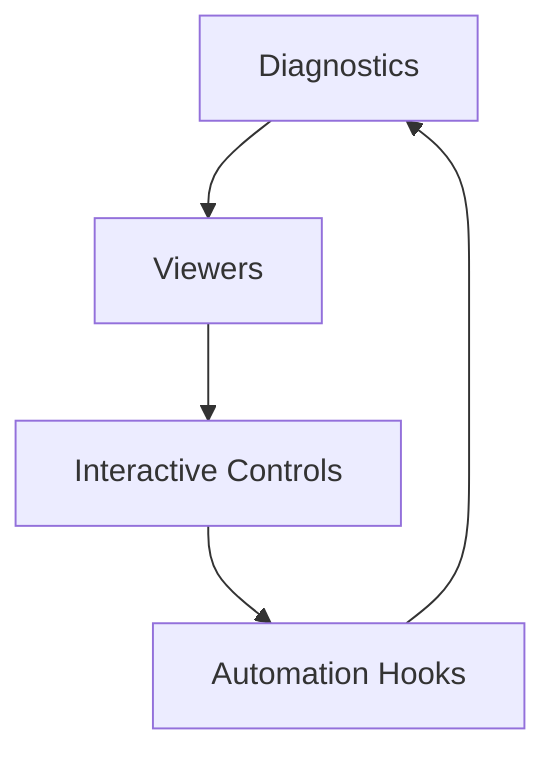

# Chapter 21 — Developer Tooling and Automation

Robust tooling shortens iteration loops. This chapter highlights Bevy-powered tools—from in-engine overlays to asset viewers—that help teams diagnose performance, inspect assets, and tweak gameplay without leaving the runtime. Each vignette points directly to the supporting example.



## Diagnostics Overlays

Instrumentation begins with visibility. `examples/dev_tools/fps_overlay.rs` demonstrates how to enable, configure, and style the built-in FPS overlay, giving you a quick heartbeat for framerate and frame time. In production, this overlay becomes part of your debug build profile, helping QA and engineers catch regressions early.


### Game Context: Titanfall Ops Bench
Performance lab **Titanfall Ops** keeps the FPS overlay (`examples/dev_tools/fps_overlay.rs`) enabled during nightly runs to catch regression spikes immediately.

## Interactive Viewers

Visual inspection tools turn abstract data into insight. `examples/tools/gamepad_viewer.rs` renders a live visualization of connected gamepads, mapping button presses, stick tilt, and trigger pressure in real time. Controllers rarely feel opaque again—use this viewer to verify custom bindings or debug drift issues.

Asset checks rely on scene viewers. `examples/tools/scene_viewer/main.rs` loads glTF models via the CLI (`cargo run --release --example scene_viewer /path/to/model.gltf`) and provides a base inspection shell.

```rust
fn build_viewer_app() -> App {
    let mut app = App::new();
    app.add_plugins(DefaultPlugins)
        .add_plugins(SceneViewerPlugin)
        .add_plugins(AnimationPlugin)
        .add_plugins(MorphViewerPlugin);
    app
}
```

This mirrors `examples/tools/scene_viewer/scene_viewer_plugin.rs` and friends, showing how Model Intake composes plugins before wrapping the viewer in automation scripts. The viewer becomes modular through plugins: `examples/tools/scene_viewer/scene_viewer_plugin.rs` adds configurable directional lighting and camera switching; `examples/tools/scene_viewer/animation_plugin.rs` layers animation controls for rigs embedded in the asset; and `examples/tools/scene_viewer/morph_viewer_plugin.rs` adds morph target controls and keyboard mappings for shape blending.

Together, these plugins form a cohesive toolkit for art reviews or technical validation before assets enter the game proper.


### Game Context: Aurora Controller QA
Hardware QA rig **Aurora Controller Lab** uses `examples/tools/gamepad_viewer.rs` while testing new drivers; analysts screenshot button maps to share with firmware teams.

## Automation Hooks

While these examples focus on interactive tooling, they also illustrate entry points for automation. The FPS overlay integrates with diagnostics collectors; the scene viewer’s plugins provide patterns for toggling lights, switching cameras, or collecting morph data, which you can adapt for automated screenshot capture or regression testing scripts.


Bevy currently ships these core tooling samples—FPS overlay, gamepad viewer, and the scene viewer plugin suite—so plan to extend them with proprietary exporters or capture tooling as your pipeline matures.

### Game Context: Model Intake Pipeline
Art pipeline **Model Intake** wraps the scene viewer (`examples/tools/scene_viewer/main.rs`) in CI scripts. Lighting controls (`examples/tools/scene_viewer/scene_viewer_plugin.rs`) generate day/night renders automatically, while animation and morph plugins produce looped GIFs for review.

## Practice Prompts
- Bundle the scene viewer plugins (`scene_viewer_plugin.rs`, `animation_plugin.rs`, `morph_viewer_plugin.rs`) into a standalone reviewer build that artists can use to inspect new glTF drops.
- Extend `examples/tools/gamepad_viewer.rs` to record input traces, then pair it with the overlay from `examples/dev_tools/fps_overlay.rs` to correlate performance and player input during playtests.
- Wire the scene viewer’s lighting controls into automated screenshot scripts that capture day/night lighting variations for marketing or QA baselines.

## Runbook
Explore these tools by running:

```
cargo run --example fps_overlay
cargo run --example gamepad_viewer
cargo run --release --example scene_viewer /path/to/model.gltf
```
