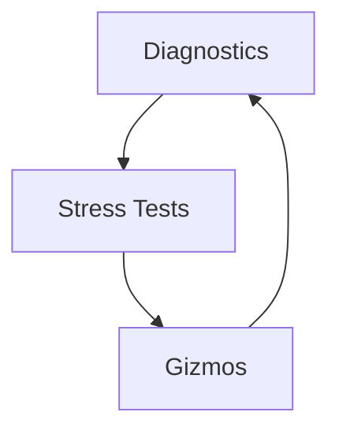
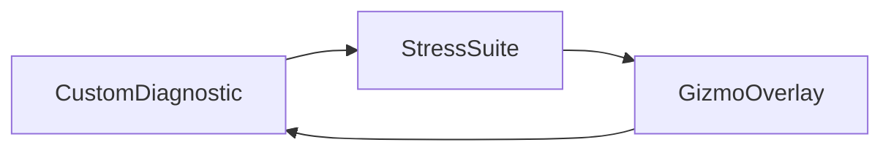

# Chapter 22 — Observability and Stress Testing

Knowing what the engine is doing—and how it performs under pressure—is as critical as writing gameplay. This chapter connects diagnostics overlays, benchmarking sandboxes, and gizmo-based visualization to keep teams confident in their builds. Every concept references the example where the technique lives.



## Diagnostics and Metrics

Bevy’s diagnostics system tells you when things drift. `examples/diagnostics/log_diagnostics.rs` activates built-in plugins that log FPS, frame time, and other metrics to the console.

```rust
fn register_diagnostics(app: &mut App) {
    app.add_plugins((FrameTimeDiagnosticsPlugin, LogDiagnosticsPlugin::default()))
        .add_plugins(CustomDiagnosticsPlugin::with_diagnostic(RecoilDiagnostic));
}
```

This setup echoes `examples/diagnostics/custom_diagnostic.rs`, showing Glacier Labs how to bundle built-in and bespoke probes in one place. When you need bespoke probes, `examples/diagnostics/custom_diagnostic.rs` registers a custom diagnostic, wiring any metric—AI latency, network RTT, script timing—into the diagnostics slate. Runtime toggles also matter: `examples/diagnostics/enabling_disabling_diagnostic.rs` shows how to disable and re-enable diagnostics without restarting, letting you keep overlays lightweight until problems surface.

With these tools, engineers can gate new features behind metric budgets and know immediately when regressions arrive.


### Game Context: Glacier Regression Lab
Shooter studio **Glacier Labs** registers recoil diagnostics (`examples/diagnostics/custom_diagnostic.rs`) that track per-frame weapon spread. Analysts toggle them on demand (`examples/diagnostics/enabling_disabling_diagnostic.rs`) when profiling new weapons.

## Stress Tests and Testbeds

Once metrics are in place, stress the system. The `examples/stress_tests` suite covers every subsystem:

- `examples/stress_tests/bevymark.rs` spawns entities on click for a 2D ECS benchmark.
- `examples/stress_tests/many_components.rs` grows worlds to millions of components, testing schedule and archetype scaling.
- `examples/stress_tests/many_lights.rs`, `examples/stress_tests/many_cameras_lights.rs`, and `examples/stress_tests/many_cubes.rs` probe the renderer under heavy light and draw-call loads.
- `examples/stress_tests/many_sprites.rs`, `examples/stress_tests/many_animated_sprites.rs`, `examples/stress_tests/many_glyphs.rs`, `examples/stress_tests/many_text2d.rs`, `examples/stress_tests/text_pipeline.rs`, and `examples/stress_tests/many_gradients.rs` exercise text, sprite, and UI rendering pipelines.
- `examples/stress_tests/many_materials.rs` and `examples/stress_tests/many_gizmos.rs` test animated material updates and debug drawing overhead.
- `examples/stress_tests/many_foxes.rs` pushes skinned meshes, while `examples/stress_tests/transform_hierarchy.rs` pounds on parent-child propagation.
- `examples/stress_tests/many_buttons.rs` stresses UI layouting and interaction.

The testbed examples add guided tours: `examples/testbed/2d.rs`, `examples/testbed/3d.rs`, and `examples/testbed/ui.rs` rotate through curated scenes, with `examples/testbed/helpers.rs` orchestrating scene changes and screenshot capture. `examples/testbed/full_ui.rs` acts as a UI showcase, blending multiple widgets and layouts into a single evaluation surface.

Together, these scenarios become regression suites. Run them before releases, during engine upgrades, or when optimizing new hardware targets.


These are the canonical stress fixtures shipping with Bevy today; treat them as a baseline regression suite and extend with project-specific tests when new subsystems land.

### Game Context: Reactor Performance Suite
Engine group **Reactor** runs nightly stress tests—`examples/stress_tests/many_components.rs` for ECS scaling, `examples/stress_tests/many_lights.rs` for lighting, and `examples/stress_tests/many_glyphs.rs` for text—to catch regressions before features land. Testbeds (`examples/testbed/3d.rs`) cycle through curated scenes while bots take screenshots for design review.

## Gizmos and Visual Debugging

Metrics and benchmarks answer “how fast?” Gizmos answer “where?”. `examples/gizmos/2d_gizmos.rs` and `examples/gizmos/3d_gizmos.rs` introduce the immediate-mode drawing API—perfect for inspecting hitboxes, navigation meshes, or pathfinding debug lines.

```rust
fn draw_navmesh(mut gizmos: Gizmos, navmesh: Res<Navmesh>) {
    for edge in navmesh.edges() {
        gizmos.line(edge.start, edge.end, Color::CYAN);
    }
}
```

Pulled from `examples/gizmos/3d_gizmos.rs`, this loop shows Nebula Frontier how to render debug lines straight from navigation data. `examples/gizmos/axes.rs` renders axis gizmos to verify orientation, and `examples/gizmos/light_gizmos.rs` visualises light frustums and ranges, ensuring lighting rigs match designer intent.




### Game Context: Nebula Debug Overlay
Open-world team **Nebula Frontier** overlays navmesh debug lines with `examples/gizmos/3d_gizmos.rs` and toggles light visualization (`examples/gizmos/light_gizmos.rs`) when tuning day/night cycles.

## Practice Prompts
- Integrate a custom diagnostic (`examples/diagnostics/custom_diagnostic.rs`) with a benchmark like `examples/stress_tests/many_lights.rs` to track lighting costs per frame and fail automated tests if budgets drift.
- Use `examples/testbed/helpers.rs` to capture screenshots from the 3D testbed after each scene change, overlaying gizmo data from `examples/gizmos/light_gizmos.rs` for lighting reviews.
- Combine `examples/diagnostics/enabling_disabling_diagnostic.rs` with a custom ECS benchmark so designers can toggle diagnostics during playtests without restarting builds.

## Runbook
Explore the observability toolkit with:

```
cargo run --example log_diagnostics
cargo run --example custom_diagnostic
cargo run --release --example bevymark
cargo run --example many_lights
cargo run --example 3d_gizmos
```
