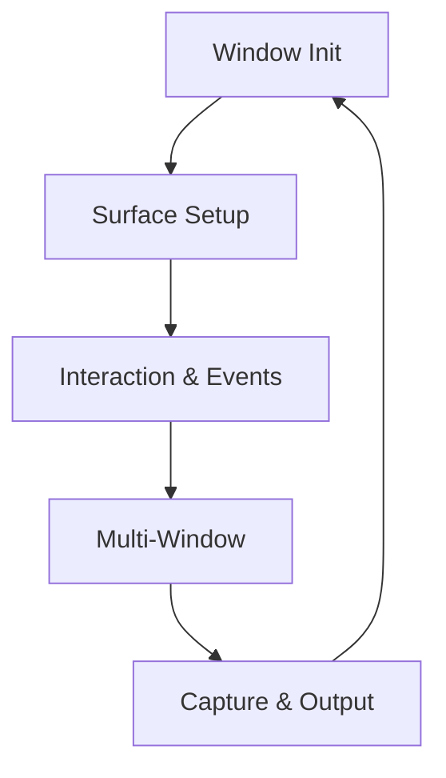
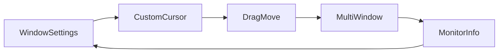

# Chapter 23 — Windows and Presentation

Window management sets the stage for everything else. This chapter walks through Bevy’s window APIs—color clears, custom cursors, multi-window setups, and platform-specific nuances—so you can ship polished desktop or kiosk experiences. Each section references the example that demonstrates the concept.



## Configuring Windows

Every frame starts with a surface. `examples/window/clear_color.rs` sets the clear color so background tones match your brand before any geometry renders. `examples/window/window_settings.rs` surfaces core configuration—title, mode, cursor visibility—while `examples/window/scale_factor_override.rs` overrides OS-imposed scale factors, ensuring crisp UI on high-DPI displays or custom kiosks. When power consumption matters, `examples/window/low_power.rs` switches the event loop into a reactive mode, letting desktop apps idle quietly when nothing changes.

Transparency and theming come next. `examples/window/transparent_window.rs` removes the opaque background so overlays float above the desktop, perfect for stream widgets or creative tools. Responsive apps also handle dynamic resizing—`examples/window/window_resizing.rs` illustrates how to respond to user-initiated resizes and adjust internal state accordingly.

```rust
fn configure_window() -> WindowPlugin {
    WindowPlugin {
        primary_window: Some(Window {
            title: "Lumen Studio".into(),
            present_mode: PresentMode::AutoNoVsync,
            resizable: true,
            ..default()
        }),
        ..default()
    }
}
```

This configuration mirrors the pattern in `examples/window/window_settings.rs`, showing how Lumen Studio pins presentation mode and window flags before the app boots.


### Game Context: Lumen Studio Playtest Builds
Video-tool suite **Lumen Studio** spins up the development dashboard with `examples/window/window_settings.rs` so testers can toggle fullscreen or cursor locking quickly. The clear color pathway mirrors the brand palette, keeping capture footage consistent. On battery-sensitive laptops the reactive loop from `examples/window/low_power.rs` prevents the app from pegging the CPU when idle.

#### When to Avoid It
For live stage demos the crew disables low-power mode—presentations with constant animation need the event loop running nonstop or transitions can look stuttery.

## Interaction and Customization

Windows invite direct user input. `examples/window/custom_cursor_image.rs` replaces the system cursor with an animated atlas-driven version, matching in-game aesthetics. Dragging windows without decorations becomes possible through `examples/window/window_drag_move.rs`, which wires pointer events to move or resize the surface when titlebars are absent. For bespoke workflows, `examples/window/custom_user_event.rs` registers a custom event type, showing how to integrate winit’s event loop with domain-specific messages.


### Game Context: Skyline HUD Overlay
Stream overlay **Skyline HUD** replaces the cursor via `examples/window/custom_cursor_image.rs` to match the broadcast theme. During rehearsals the director toggles passthrough (`examples/window/window_drag_move.rs`) so operators can drag the translucent overlay without leaving Bevy. Custom user events (`examples/window/custom_user_event.rs`) sync the overlay with OBS transitions.

#### When to Avoid It
Skyline avoids custom cursor logic on kiosk builds where players use controllers—the default system cursor already hides itself and keeps accessibility features intact.

## Multi-Window Rendering

Multi-window pipelines are straightforward. `examples/window/multiple_windows.rs` spawns two windows to visualize a 3D model from different angles; it highlights how each window receives its own camera and swap chain. Text rendering across disparate DPI settings is covered in `examples/window/multi_window_text.rs`, which renders both UI (`Text`) and world text (`Text2d`) into separate windows with different scale factors.

Monitor context is indispensable for multi-display setups—`examples/window/monitor_info.rs` enumerates available monitors so you can position windows intentionally on launch.




### Game Context: Solaris Control Booth
Mission control sim **Solaris** displays 3D telemetry in one window and textual diagnostics in another using `examples/window/multiple_windows.rs`. The text window leverages `examples/window/multi_window_text.rs` to stay readable on a high-DPI vertical monitor, while `examples/window/monitor_info.rs` ensures each window restores to the correct display after a restart.

#### When to Avoid It
On portable devices Solaris collapses down to a single window; managing multiple surfaces on a tablet confuses the OS-level task switcher.

## Capture and Output

Sometimes you need to save what you see. `examples/window/screenshot.rs` captures frames to disk, providing a starting point for bug repro steps or automated marketing capture. Combined with camera controllers or overlays from earlier chapters, it forms the basis for QA tools.


### Game Context: Ember QA Snapshots
Quality assurance tool **Ember Snap** hooks into `examples/window/screenshot.rs` so testers can capture reproducible bug reports. Screenshots accompany automated logs from Chapter 22 to give engineers full context when triaging issues.

#### When to Avoid It
During high-action multiplayer matches the team prefers video capture tools outside the engine—frame-by-frame screenshots miss timing-dependent desyncs.

## Practice Prompts
- Build a presentation kiosk by combining `examples/window/transparent_window.rs` with animated cursors (`custom_cursor_image.rs`) and reactive loops (`low_power.rs`) so overlays stay lively without hogging CPU.
- Launch analytics dashboards across multiple displays using `examples/window/multiple_windows.rs`, then render DPI-aware text via `examples/window/multi_window_text.rs` while `monitor_info.rs` picks the correct monitor.
- Pair `examples/window/window_drag_move.rs` with the screenshot workflow so designers can rearrange tool panels and capture layout snapshots rapidly.

## Runbook
Kick off your window experiments with:

```
cargo run --example window_settings
cargo run --example custom_cursor_image
cargo run --example multiple_windows
cargo run --example screenshot
```
