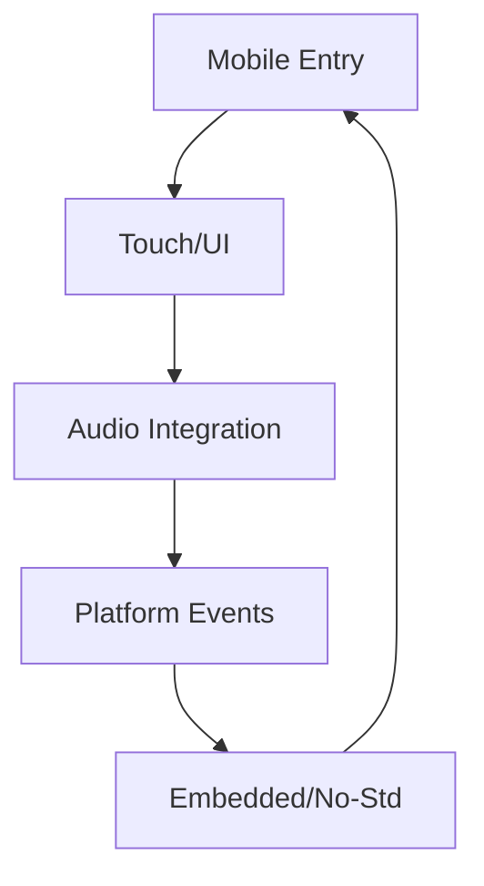

# Chapter 24 — Target Platforms

Shipping to new platforms means adapting entry points, runtime constraints, and build tooling. This chapter digs into mobile integration and `no_std` support so you can bring Bevy to phones, tablets, or constrained environments. Each paragraph links back to the examples that prove the workflow.



## Mobile Platforms

### Deep Dive: Native Shell Integration
`examples/mobile/src/main.rs` wires Bevy into the iOS run loop via `UIApplicationMain`, while `examples/mobile/src/lib.rs` exposes a reusable Rust entry point that Android JNI wrappers can call as well. SkyRail keeps gameplay code shared between desktop and mobile, with each platform project only handling lifecycle hooks and asset location.

#### When to Avoid It
If your game relies heavily on platform SDK UI (for example, fully native menus), consider launching those natively and embedding Bevy for the 3D view only—forcing everything through the engine complicates certification.


The mobile example lives in the `examples/mobile` crate. `examples/mobile/src/main.rs` is the iOS entry point, showing how to bootstrap Bevy inside an Apple application bundle—tying into Xcode projects and UIApplication lifecycles. `examples/mobile/src/lib.rs` hosts the Bevy app logic: a 3D scene with a UI button and background audio, demonstrating how touch input, rendering, and audio playback work together on mobile hardware.

This separation mirrors production setups: native shells handle platform-specific glue while shared Rust libraries deliver gameplay, UI, and audio across iOS and Android builds.

```rust
#[no_mangle]
pub extern "C" fn bevy_main() {
    App::new()
        .add_plugins(DefaultPlugins.set(WindowPlugin {
            primary_window: Some(Window {
                title: "SkyRail Dispatch".into(),
                ..default()
            }),
            ..default()
        }))
        .add_systems(Update, (pulse_button, play_background_audio))
        .run();
}
```

The entry point is trimmed down from `examples/mobile/src/lib.rs`, showing how the shared Rust library exposes a C ABI function that iOS and Android shells can call while keeping gameplay code cross-platform.


### Game Context: SkyRail Dispatch Mobile
Operations sim **SkyRail Dispatch** runs its touch-first UI inside the mobile crate: `examples/mobile/src/main.rs` handles the Obj-C entry point while `examples/mobile/src/lib.rs` delivers the shared Rust gameplay. Designers use this structure to iterate on the desktop build and mobile shell simultaneously without duplicating logic.

#### When to Avoid It
Platform code stays minimal; heavy services (analytics, login integrations) live in Rust modules rather than the Objective-C harness so features remain cross-platform.

## no_std and Embedded Targets

### Deep Dive: Headless Modules
`examples/no_std/library/src/lib.rs` strips out the standard library so Orbex can run autopilot logic on microcontrollers. The library exposes ECS schedules but defers I/O to the host firmware, proving you can reuse Bevy’s data model without dragging in windowing or alloc-heavy systems.

#### When to Avoid It
Keep `no_std` crates small and purpose-built—once you need filesystems, networking, or audio, reintroducing `std` is usually simpler than reimplementing the world.


Constrained platforms often require `no_std`. `examples/no_std/library/src/lib.rs` illustrates the patterns for creating a `no_std`-compatible Bevy library: annotate with `#![no_std]`, manage allocator choices, and expose core systems without depending on the full standard library. It becomes the foundation for headless simulations, embedded devices, or custom runners where standard I/O is unavailable.

```rust
#![no_std]

pub fn update(app: &mut App) {
    app.world.resource_mut::<SimulationClock>().tick();
    app.update();
}
```

Lifted from `examples/no_std/library/src/lib.rs`, this pattern keeps the API minimal so host firmware can call into Bevy without pulling in the rest of `std`.


The repository currently showcases this single `no_std` library; expect to layer your own HAL or RTOS integration on top until more embedded samples ship.

### Game Context: Orbex Flight Computer
Spaceflight prototype **Orbex** packages autopilot logic as a `no_std` Bevy library following `examples/no_std/library/src/lib.rs`. Engineers embed the crate into microcontrollers that operate life-support simulations without an operating system.

#### When to Avoid It
The interactive cockpit UI still uses the full Bevy stack; rewriting the entire interface for `no_std` would sacrifice developer productivity with little benefit.

## Practice Prompts
- Embed `examples/mobile/src/lib.rs` into a native Android shell, mirroring the iOS entry pattern to keep UI and audio consistent across both mobile ecosystems.
- Build a minimal server binary by starting from `examples/no_std/library/src/lib.rs`, adding only the systems required for simulation while integrating with the diagnostic tooling discussed in earlier chapters.

## Runbook
Experiment with platform-specific builds by exploring:

```
cargo run --example mobile --target aarch64-apple-ios-sim
cargo run --example no_std_library
```
